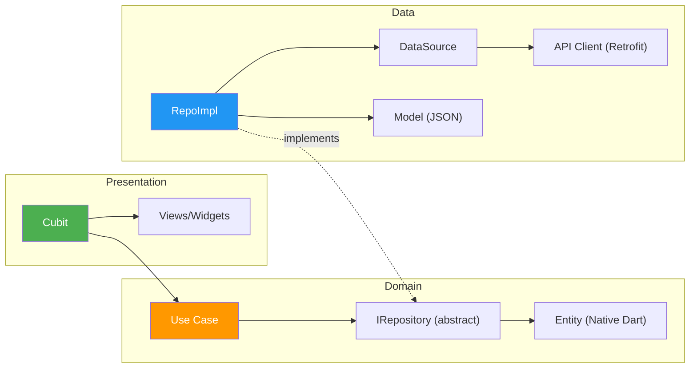

# PROJECT_CONTEXT.md

<!--
Project-specific context for سَـنَـا (Sana).
This file complements CLAUDE.md (general rules) with project-specific architecture, structure, and decisions.
Always read both CLAUDE.md and this file when working on this project.
-->

---

# Section A — Project Identity & Infrastructure

## App Identity
- **Name**: سَـنَـا (Sana) — An Islamic companion app
- **Locale**: Arabic (`ar_EG`), RTL layout, dark theme only
- **Fonts**: Cairo (UI), UthmanTaha (Quranic text)
- **Target platforms**: Android, iOS, Web

## Key Infrastructure
| Concern | Solution |
|---|---|
| State Management | `flutter_bloc` (Cubit) |
| DI | `get_it` |
| Navigation | `go_router` (centralized registration in `core/routing/app_router.dart`) |
| Networking | `dio` + `retrofit` (code-gen) + interceptor chain |
| Local Storage | `hive_flutter` (via `ILocalStorageService`) |
| Error Modeling | Sealed `Failure` hierarchy + `ApiResult<T>` |
| Serialization | Native Dart 3 (Sealed classes, manual JSON) |
| Asset Safety | `flutter_gen` (ALLOWED) → `Assets.images.*`, `Assets.svgs.*` |
| Cloud Database | Firebase Firestore (used in Developer Dashboard) |
| Observability | Firebase Analytics, Crashlytics, Performance |
| OTA Updates | Shorebird |
| Linting | `very_good_analysis` |
| Preview Tool | `device_preview` (enabled in `main.dart`) |

## Bootstrap Order
1. `main()` → `initializeApp()` — Firebase, DI, locale, orientation, global animations
2. `runApp(DevicePreview(SanaApp()))` — first frame renders with UpdateOverlay in builder
3. `initializeAppPostFrame()` — heavy services: WorkManager, Remote Config, Religious Events, Location status management

## Feature DI Registration Order (in `service_locator.dart`)
1. `setupCoreDependencies(sl)` — Hive, Firebase, Dio, API clients, core services
2. `setupFeaturesDependencies(sl)` — All feature repos, cubits, use cases, location, qibla, etc.

---

# Section B — Architecture & Folder Structure

## 📁 Complete Project Structure

```
sana/
├── 📄 main.dart                          # App entry point & SanaApp widget
├── 📄 pubspec.yaml                       # Dependencies & assets
├── 📄 analysis_options.yaml              # Linting rules (very_good_analysis)
│
├── 📂 core/                              # ━━━ SHARED INFRASTRUCTURE ━━━
│   ├── 📂 common/                        # Reusable UI building blocks
│   │   ├── 📂 animations/
│   │   │   ├── 📄 app_animations.dart
│   │   │   └── 📄 press_scale_widget.dart
│   │   ├── 📂 buttons/
│   │   │   ├── 📄 app_buttons.dart
│   │   │   ├── 📄 custom_arrow_back_button.dart
│   │   │   ├── 📄 custom_search_icon_button.dart
│   │   │   └── 📄 lightbulb_button.dart
│   │   ├── 📂 decorations/
│   │   │   ├── 📄 custom_app_card_decoration.dart
│   │   │   ├── 📄 custom_app_divider.dart
│   │   │   └── 📄 feature_card_decoration.dart
│   │   ├── 📂 favorites/
│   │   │   ├── 📄 custom_favorite_toggle_button.dart
│   │   │   └── 📄 no_favorites_yet.dart
│   │   ├── 📂 layout/
│   │   │   ├── 📄 custom_carousel_slider.dart
│   │   │   └── 📄 responsive_wrapper.dart
│   │   ├── 📂 overlays/
│   │   │   ├── 📂 bottom_sheet/
│   │   │   │   ├── 📄 custom_bottom_sheet_widget.dart
│   │   │   │   └── 📄 show_custom_bottom_sheet.dart
│   │   │   ├── 📂 dialog/
│   │   │   │   ├── 📄 custom_confirmation_dialog.dart
│   │   │   │   ├── 📄 custom_dialog.dart
│   │   │   │   ├── 📄 custom_info_dialog.dart
│   │   │   │   ├── 📄 custom_rich_content_dialog.dart
│   │   │   │   └── 📄 daily_content_explanation_dialog.dart
│   │   │   └── 📂 toast/
│   │   │       ├── 📄 app_toast.dart
│   │   │       ├── 📄 app_toast_models.dart
│   │   │       └── 📄 favorite_toast.dart
│   │   ├── 📂 slivers/
│   │   │   ├── 📄 animated_sliver_list.dart
│   │   │   └── 📄 common_sliver_app_bar.dart
│   │   └── 📂 widgets/
│   │       ├── 📄 app_arrow_icon.dart
│   │       ├── 📄 app_empty_view.dart
│   │       ├── 📄 app_error_view.dart
│   │       ├── 📄 app_toggle_list.dart
│   │       ├── 📄 not_found_view.dart
│   │       └── 📂 card/
│   │           └── 📄 daily_content_base_card.dart
│   │
│   ├── 📂 constants/
│   │   ├── 📄 api_endpoints.dart
│   │   ├── 📄 app_constants.dart
│   │   ├── 📄 app_links.dart
│   │   ├── 📄 app_strings.dart
│   │   ├── 📄 religious_event_display_names.dart
│   │   └── 📂 generated/
│   │       ├── 📄 assets.gen.dart
│   │       └── 📄 fonts.gen.dart
│   │
│   ├── 📂 di/
│   │   ├── 📄 core_di.dart
│   │   ├── 📄 features_di.dart
│   │   └── 📄 service_locator.dart
│   │
│   ├── 📂 error/
│   │   └── 📄 failure.dart
│   │
│   ├── 📂 networking/
│   │   ├── 📄 api_error_handler.dart
│   │   ├── 📄 api_result.dart
│   │   ├── 📄 app_headers_interceptor.dart
│   │   ├── 📄 cors_interceptor.dart
│   │   ├── 📄 dio_factory.dart
│   │   ├── 📄 performance_interceptor.dart
│   │   └── 📂 api_clients/
│   │       ├── 📄 dorar_api_client.dart
│   │       ├── 📄 dorar_api_client.g.dart
│   │       ├── 📄 location_api_client.dart
│   │       └── 📄 location_api_client.g.dart
│   │
│   ├── 📂 routing/
│   │   ├── 📄 app_router.dart
│   │   ├── 📄 app_routes.dart
│   │   └── 📄 app_transitions.dart
│   │
│   ├── 📂 services/
│   │   ├── 📂 analytics/
│   │   │   ├── 📄 analytics_service.dart
│   │   │   └── 📄 firebase_analytics_service.dart
│   │   ├── 📂 app_date/
│   │   │   ├── 📂 data/
│   │   │   │   ├── 📂 models/
│   │   │   │   │   └── 📄 app_date_model.dart
│   │   │   │   └── 📂 repositories/
│   │   │   │       ├── 📄 app_date_repository.dart
│   │   │   │       └── 📄 i_app_date_repository.dart
│   │   │   └── 📂 presentation/
│   │   │       ├── 📂 cubit/
│   │   │       │   ├── 📄 app_date_cubit.dart
│   │   │       │   └── 📄 app_date_state.dart
│   │   │       └── 📂 widgets/
│   │   │           ├── 📄 hijri_adjustment_bottom_sheet.dart
│   │   │           └── 📄 hijri_and_gregorian_date_widget.dart
│   │   ├── 📂 app_update/
│   │   │   ├── 📂 data/
│   │   │   │   ├── 📂 constants/
│   │   │   │   │   └── 📄 remote_config_keys.dart
│   │   │   │   ├── 📂 models/
│   │   │   │   │   └── 📄 update_config_model.dart
│   │   │   │   └── 📂 repositories/
│   │   │   │       └── 📄 app_update_repository.dart
│   │   │   └── 📂 presentation/
│   │   │       ├── 📂 cubit/
│   │   │       │   ├── 📄 app_update_cubit.dart
│   │   │       │   └── 📄 app_update_state.dart
│   │   │       └── 📂 widgets/
│   │   │           ├── 📄 force_update_overlay.dart
│   │   │           ├── 📄 optional_update_banner.dart
│   │   │           ├── 📄 update_icon.dart
│   │   │           └── 📄 update_overlay.dart
│   │   ├── 📂 background/
│   │   │   ├── 📄 i_work_manager_service.dart
│   │   │   └── 📄 work_manager_service_impl.dart
│   │   ├── 📂 device_info/
│   │   │   └── 📄 device_info_service.dart
│   │   ├── 📂 firebase/
│   │   │   └── 📄 firebase_options.dart
│   │   ├── 📂 local_storage/
│   │   │   ├── 📄 i_local_storage_service.dart
│   │   │   ├── 📄 local_storage_service_impl.dart
│   │   │   └── 📄 storage_keys.dart
│   │   ├── 📂 location_manager/
│   │   │   ├── 📂 data/
│   │   │   │   ├── 📂 constants/
│   │   │   │   │   ├── 📄 arab_countries.dart
│   │   │   │   │   └── 📄 location_api_constants.dart
│   │   │   │   ├── 📂 datasources/
│   │   │   │   │   ├── 📄 location_local_data_source.dart
│   │   │   │   │   └── 📄 location_remote_data_source.dart
│   │   │   │   ├── 📂 models/
│   │   │   │   │   └── 📄 nominatim_response_model.dart
│   │   │   │   └── 📂 repositories/
│   │   │   │       ├── 📄 i_location_repository.dart
│   │   │   │       └── 📄 location_repo_impl.dart
│   │   │   └── 📂 presentation/
│   │   │       ├── 📂 cubit/
│   │   │       │   ├── 📂 location_name/
│   │   │       │   │   ├── 📄 location_name_cubit.dart
│   │   │       │   │   └── 📄 location_name_state.dart
│   │   │       │   └── 📂 location_permission/
│   │   │       │       ├── 📄 location_cubit.dart
│   │   │       │       └── 📄 location_state.dart
│   │   │       └── 📂 widgets/
│   │   │           └── 📄 location_guard.dart
│   │   ├── 📂 notification/
│   │   │   ├── 📄 i_notification_service.dart
│   │   │   └── 📄 notification_service_impl.dart
│   │   ├── 📂 permissions/
│   │   │   └── 📄 app_permissions_manager.dart
│   │   └── 📂 sharing/
│   │       ├── 📂 logic/
│   │       │   ├── 📄 i_share_service.dart
│   │       │   └── 📄 share_service.dart
│   │       ├── 📂 models/
│   │       │   └── 📄 share_config.dart
│   │       └── 📂 presentation/
│   │           ├── 📄 app_info_share.dart
│   │           ├── 📄 combined_share_copy_button.dart
│   │           ├── 📄 share_card_container.dart
│   │           └── 📂 utils/
│   │               └── 📄 widget_to_image_helper.dart
│   │
│   ├── 📂 theme/
│   │   ├── 📂 fonts/
│   │   │   ├── 📄 app_fonts_family.dart
│   │   │   └── 📄 app_text_styles.dart
│   │   └── 📂 style/
│   │       ├── 📄 app_colors.dart
│   │       ├── 📄 app_spacing.dart
│   │       └── 📄 app_theme.dart
│   │
│   └── 📂 utils/
│       ├── 📄 app_date_formatter.dart
│       ├── 📄 app_feedback.dart
│       ├── 📄 app_logger.dart
│       ├── 📄 bloc_observer.dart
│       ├── 📄 color_extension.dart
│       ├── 📄 context_extension.dart
│       ├── 📄 regex.dart
│       └── 📄 version_utils.dart
│
├── 📂 features/                          # ━━━ FEATURE MODULES ━━━
│   ├── 📂 home/
│   │   ├── 📂 data/
│   │   │   ├── 📂 datasources/
│   │   │   │   └── 📄 features_local_data_source.dart
│   │   │   ├── 📂 models/
│   │   │   │   └── 📄 home_feature_model.dart
│   │   │   └── 📂 repos/
│   │   │       └── 📄 features_repository.dart
│   │   └── 📂 presentation/
│   │       ├── 📂 cubit/
│   │       │   └── 📄 features_list_cubit.dart
│   │       ├── 📂 views/
│   │       │   └── 📄 home_view.dart
│   │       ├── 📂 widgets/
│   │       │   ├── 📄 custom_badge.dart
│   │       │   ├── 📄 feature_circular_card.dart
│   │       │   ├── 📂 sections/
│   │       │   │   ├── 📄 home_azkar_category_section.dart
│   │       │   │   ├── 📄 home_daily_wisdom_section.dart
│   │       │   │   ├── 📄 home_features_category_section.dart
│   │       │   │   ├── 📄 home_prayer_section.dart
│   │       │   │   ├── 📄 home_quran_card_section.dart
│   │       │   │   └── 📄 home_settings_section.dart
│   │       │   └── 📂 skeleton/
│   │       │       ├── 📄 skeletonizer_home_daily_wisdom.dart
│   │       │       └── 📄 skeletonizer_home_prayer.dart
│   │
│   ├── 📂 asma_ul_husna/
│   │   ├── 📂 constants/
│   │   │   └── 📄 asma_keys.dart
│   │   ├── 📂 data/
│   │   │   ├── 📂 datasources/
│   │   │   │   └── 📄 asma_ul_husna_local_data_source.dart
│   │   │   ├── 📂 models/
│   │   │   │   └── 📄 asmaul_husna_model.dart
│   │   │   └── 📂 repos/
│   │   │       └── 📄 asma_ul_husna_repository.dart
│   │   └── 📂 presentation/
│   │       ├── 📂 cubit/
│   │       │   ├── 📄 asma_ul_husna_cubit.dart
│   │       │   └── 📄 asma_ul_husna_state.dart
│   │       ├── 📂 views/
│   │       │   └── 📄 asma_ul_husna_view.dart
│   │       └── 📂 widgets/
│   │           ├── 📄 asma_ul_husna_card.dart
│   │           ├── 📄 skeletonizer_loading_asma_ul_husna_view.dart
│   │           ├── 📂 card/
│   │           │   └── 📄 daily_asma_ul_husna_card.dart
│   │           └── 📂 share_card/
│   │               └── 📄 asma_ul_husna_share_card.dart
│   │
│   ├── 📂 azkar/
│   │   ├── 📂 constants/
│   │   │   └── 📄 azkar_keys.dart
│   │   ├── 📂 data/
│   │   │   ├── 📂 datasources/
│   │   │   │   └── 📄 azkar_local_data_source.dart
│   │   │   ├── 📂 models/
│   │   │   │   ├── 📄 azkar_category_model.dart
│   │   │   │   └── 📄 zikr_model.dart
│   │   │   └── 📂 repos/
│   │   │       └── 📄 azkar_repository.dart
│   │   └── 📂 presentation/
│   │       ├── 📂 cubit/
│   │       │   ├── 📄 azkar_categories_cubit.dart
│   │       │   ├── 📄 azkar_category_loader_cubit.dart
│   │       │   └── 📄 azkar_list_cubit.dart
│   │       ├── 📂 utils/
│   │       │   └── 📄 azkar_ui_helpers.dart
│   │       ├── 📂 views/
│   │       │   ├── 📄 all_azkar_categories_view.dart
│   │       │   ├── 📄 azkar_details_loader_view.dart
│   │       │   └── 📄 azkar_list_view.dart
│   │       └── 📂 widgets/
│   │           ├── 📄 azkar_list_content.dart
│   │           ├── 📄 zikr_item_card.dart
│   │           ├── 📂 share_card/
│   │           │   └── 📄 zikr_share_card.dart
│   │           └── 📂 zikr_card/
│   │               ├── 📄 zikr_actions_row.dart
│   │               ├── 📄 zikr_content.dart
│   │               └── 📄 zikr_counter.dart
│   │
│   ├── 📂 daily_content/
│   │   ├── 📂 constants/
│   │   │   └── 📄 daily_content_keys.dart
│   │   ├── 📂 data/
│   │   │   ├── 📂 datasources/
│   │   │   │   └── 📄 daily_content_datasource.dart
│   │   │   ├── 📂 models/
│   │   │   │   └── 📄 daily_content_model.dart
│   │   │   └── 📂 repos/
│   │   │       └── 📄 daily_content_repository.dart
│   │   └── 📂 presentation/
│   │       ├── 📂 cubit/
│   │       │   ├── 📄 daily_content_cubit.dart
│   │       │   └── 📄 daily_content_state.dart
│   │       ├── 📂 views/
│   │       │   └── 📄 daily_content_favorites_view.dart
│   │       └── 📂 widgets/
│   │           ├── 📄 daily_content_dialog.dart
│   │           ├── 📂 card/
│   │           │   ├── 📄 daily_hadith_card.dart
│   │           │   └── 📄 daily_sunnah_card.dart
│   │           └── 📂 share_card/
│   │               └── 📄 daily_content_share_card.dart
│   │
│   ├── 📂 hadith_search/
│   │   ├── 📂 constants/
│   │   │   └── 📄 hadith_api_constants.dart
│   │   ├── 📂 data/
│   │   │   ├── 📂 datasources/
│   │   │   │   ├── 📄 hadith_remote_data_source.dart
│   │   │   │   └── 📄 i_hadith_remote_data_source.dart
│   │   │   ├── 📂 models/
│   │   │   │   ├── 📄 hadith_judgment.dart
│   │   │   │   └── 📄 hadith_model.dart
│   │   │   └── 📂 repos/
│   │   │       ├── 📄 hadith_favorites_repository.dart
│   │   │       ├── 📄 hadith_repository.dart
│   │   │       ├── 📄 i_hadith_favorites_repository.dart
│   │   │       └── 📄 i_hadith_repository.dart
│   │   ├── 📂 presentation/
│   │   │   ├── 📂 cubit/
│   │   │   │   ├── 📂 hadith_favorites/
│   │   │   │   │   ├── 📄 hadith_favorites_cubit.dart
│   │   │   │   │   └── 📄 hadith_favorites_state.dart
│   │   │   │   └── 📂 hadith_search/
│   │   │   │       ├── 📄 hadith_search_cubit.dart
│   │   │   │       └── 📄 hadith_search_state.dart
│   │   │   ├── 📂 views/
│   │   │   │   ├── 📄 hadith_favorites_view.dart
│   │   │   │   └── 📄 hadith_search_view.dart
│   │   │   └── 📂 widgets/
│   │   │       ├── 📄 hadith_content_widget.dart
│   │   │       ├── 📄 hadith_error_view.dart
│   │   │       ├── 📄 hadith_item_card.dart
│   │   │       ├── 📄 hadith_results_builder.dart
│   │   │       ├── 📄 hadith_search_body.dart
│   │   │       ├── 📄 hadith_search_share_and_favorite_buttons.dart
│   │   │       ├── 📄 hadith_search_sliver_app_bar.dart
│   │   │       ├── 📄 hadith_search_text_field.dart
│   │   │       ├── 📄 hadith_success_list_view.dart
│   │   │       ├── 📄 skeletonizer_loading_hadith_view.dart
│   │   │       ├── 📄 suggestions_grid.dart
│   │   │       └── 📂 share_card/
│   │   │           └── 📄 hadith_share_card.dart
│   │   └── 📂 utils/
│   │       ├── 📄 hadith_formatter.dart
│   │       ├── 📄 hadith_html_parser.dart
│   │       └── 📄 hadith_ui_mapper.dart
│   │
│   ├── 📂 prayer/
│   │   ├── 📂 constants/
│   │   │   ├── 📄 prayer_name_provider.dart
│   │   │   ├── 📄 prayer_settings_keys.dart
│   │   │   └── 📄 prayer_settings_names.dart
│   │   ├── 📂 data/
│   │   │   ├── 📂 models/
│   │   │   │   ├── 📄 coordinates_model.dart
│   │   │   │   ├── 📄 prayer_calculation_settings.dart
│   │   │   │   ├── 📄 prayer_display_model.dart
│   │   │   │   ├── 📄 prayer_info.dart
│   │   │   │   ├── 📄 prayer_state_result.dart
│   │   │   │   ├── 📄 prayer_times_entity.dart
│   │   │   │   ├── 📄 prayer_time_status.dart
│   │   │   │   ├── 📄 prayer_type.dart
│   │   │   │   ├── 📄 religious_event_model.dart
│   │   │   │   ├── 📄 sunnah_model.dart
│   │   │   │   ├── 📄 sunnah_times_entity.dart
│   │   │   │   └── 📄 user_prayer_times_settings.dart
│   │   │   ├── 📂 repos/
│   │   │   │   └── 📄 prayer_repository.dart
│   │   │   └── 📂 services/
│   │   │       ├── 📄 prayer_state_service.dart
│   │   │       ├── 📄 prayer_status_service.dart
│   │   │       ├── 📄 prayer_times_service.dart
│   │   │       ├── 📄 religious_events_service.dart
│   │   │       └── 📄 user_settings_service.dart
│   │   └── 📂 presentation/
│   │       ├── 📂 cubit/
│   │       │   ├── 📄 prayer_times_cubit.dart
│   │       │   └── 📄 prayer_times_state.dart
│   │       ├── 📂 views/
│   │       │   └── 📄 prayer_times_settings_view.dart
│   │       └── 📂 widgets/
│   │           ├── 📄 prayer_action_link.dart
│   │           ├── 📄 prayer_card_content.dart
│   │           ├── 📄 prayer_sunnah_bottom_sheet.dart
│   │           ├── 📄 prayer_timeline.dart
│   │           ├── 📄 wave_progress_widget.dart
│   │           ├── 📂 header/
│   │           │   ├── 📄 city_country_widget.dart
│   │           │   ├── 📄 home_prayer_carousel.dart
│   │           │   ├── 📄 home_prayer_loaded.dart
│   │           │   └── 📂 widgets/
│   │           │       ├── 📄 prayer_countdown_carousel_card.dart
│   │           │       ├── 📄 prayer_status_carousel_card.dart
│   │           │       ├── 📄 prayer_status_details_dialog.dart
│   │           │       └── 📄 religious_event_carousel_card.dart
│   │           ├── 📂 prayer_settings/
│   │           │   ├── 📄 calculation_method_widget.dart
│   │           │   ├── 📄 madhab_widget.dart
│   │           │   ├── 📄 prayer_location_widget.dart
│   │           │   ├── 📄 settings_tile_widget.dart
│   │           │   └── 📄 settings_title.dart
│   │           └── 📂 share_card/
│   │               └── 📄 sunnah_share_card.dart
│   │
│   ├── 📂 qibla/
│   │   ├── 📂 constants/
│   │   │   ├── 📄 qibla_data_constants.dart
│   │   │   └── 📄 qibla_ui_constants.dart
│   │   ├── 📂 data/
│   │   │   ├── 📂 datasources/
│   │   │   │   └── 📄 qibla_local_data_source.dart
│   │   │   ├── 📂 models/
│   │   │   │   └── 📄 qibla_models.dart
│   │   │   ├── 📂 repos/
│   │   │   │   └── 📄 qibla_repository.dart
│   │   │   └── 📂 services/
│   │   │       └── 📄 qibla_service.dart
│   │   ├── 📂 domain/
│   │   │   ├── 📂 entities/
│   │   │   │   └── 📄 qibla_entities.dart
│   │   │   ├── 📂 repositories/
│   │   │   │   └── 📄 qibla_repository.dart
│   │   │   ├── 📂 services/
│   │   │   │   └── 📄 qibla_service.dart
│   │   │   └── 📂 use_cases/
│   │   │       ├── 📄 get_qibla_compass_stream_use_case.dart
│   │   │       └── 📄 get_qibla_direction_use_case.dart
│   │   └── 📂 presentation/
│   │       ├── 📂 cubit/
│   │       │   ├── 📄 qibla_cubit.dart
│   │       │   └── 📄 qibla_state.dart
│   │       ├── 📂 views/
│   │       │   └── 📄 qibla_view.dart
│   │       └── 📂 widgets/
│   │           ├── 📄 qibla_header_info.dart
│   │           ├── 📄 qibla_help_dialog.dart
│   │           ├── 📄 qibla_scaffold.dart
│   │           ├── 📄 skeletonizer_qibla_widget.dart
│   │           ├── 📂 compass/
│   │           │   ├── 📄 compass_arrow.dart
│   │           │   ├── 📄 compass_background_painter.dart
│   │           │   ├── 📄 compass_kaaba_icon.dart
│   │           │   └── 📄 qibla_compass.dart
│   │           ├── 📂 hint/
│   │           │   ├── 📄 qibla_hint_message.dart
│   │           │   └── 📄 qibla_message_config.dart
│   │           └── 📂 loaded/
│   │               ├── 📄 qibla_compass_stream_widget.dart
│   │               ├── 📄 qibla_content_layout_widget.dart
│   │               └── 📄 qibla_view_loaded_widget.dart
│   │
│   ├── 📂 quran/
│   │   ├── 📂 data/
│   │   │   └── 📂 repos/
│   │   │       └── 📄 quran_repo.dart
│   │   └── 📂 presentation/
│   │       ├── 📂 cubit/
│   │       │   ├── 📄 quran_cubit.dart
│   │       │   └── 📄 quran_state.dart
│   │       ├── 📂 views/
│   │       │   └── 📄 quran_view.dart
│   │       └── 📂 widgets/
│   │           ├── 📄 quran_error_widget.dart
│   │           ├── 📄 quran_loading_widget.dart
│   │           └── 📄 quran_success_widget.dart
│   │
│   ├── 📂 salat_ala_nabi/
│   │   ├── 📂 data/
│   │   │   ├── 📄 salawat_constants.dart
│   │   │   ├── 📂 datasources/
│   │   │   │   └── 📄 reminder_local_data_source.dart
│   │   │   ├── 📂 models/
│   │   │   │   └── 📄 reminder_settings.dart
│   │   │   ├── 📂 repos/
│   │   │   │   └── 📄 reminder_repo.dart
│   │   │   └── 📂 services/
│   │   │       ├── 📄 salawat_background_executor.dart
│   │   │       └── 📄 salawat_reminder_service.dart
│   │   └── 📂 presentation/
│   │       ├── 📂 cubit/
│   │       │   ├── 📄 reminder_cubit.dart
│   │       │   └── 📄 reminder_state.dart
│   │       ├── 📂 views/
│   │       │   └── 📄 salat_ala_nabi_view.dart
│   │       └── 📂 widgets/
│   │           ├── 📄 custom_working_hour_option.dart
│   │           ├── 📄 interval_counter_widget.dart
│   │           ├── 📄 notification_and_enable_salat_alarm_toggle_widget.dart
│   │           ├── 📄 salat_ala_nabi_skeleton.dart
│   │           ├── 📄 salat_ala_nabi_view_content.dart
│   │           ├── 📄 salawat_option_card.dart
│   │           ├── 📄 toggle_title_and_switch_widget.dart
│   │           ├── 📄 working_hours_widget.dart
│   │           └── 📄 working_hour_option_item.dart
│   │
│   ├── 📂 splash/
│   │   └── 📂 presentation/
│   │       ├── 📂 views/
│   │       │   └── 📄 splash_view.dart
│   │       └── 📂 widgets/
│   │           └── 📄 splash_logo_and_name.dart
│   │
│   ├── 📂 teaching_prayer/
│   │   ├── 📂 constants/
│   │   │   └── 📄 teaching_prayer_keys.dart
│   │   ├── 📂 data/
│   │   │   ├── 📂 datasources/
│   │   │   │   └── 📄 teaching_prayer_local_data_source.dart
│   │   │   ├── 📂 models/
│   │   │   │   └── 📄 teaching_prayer_model.dart
│   │   │   └── 📂 repos/
│   │   │       └── 📄 teaching_prayer_repo_impl.dart
│   │   ├── 📂 presentation/
│   │   │   ├── 📂 cubit/
│   │   │   │   ├── 📄 teaching_prayer_cubit.dart
│   │   │   │   └── 📄 teaching_prayer_state.dart
│   │   │   ├── 📂 views/
│   │   │   │   └── 📄 teaching_prayer_view.dart
│   │   │   └── 📂 widgets/
│   │   │       ├── 📄 teaching_prayer_error_widget.dart
│   │   │       ├── 📄 teaching_prayer_loading_widget.dart
│   │   │       ├── 📄 teaching_prayer_success_widget.dart
│   │   │       ├── 📄 teaching_section_card.dart
│   │   │       └── 📄 teaching_topic_card.dart
│   │   ├── 📂 utils/
│   │   │   └── 📄 teaching_content_parser.dart
│   │   └── 📄 teaching_prayer_testing.md
│   │
│   ├── 📂 developer_dashboard/
│   │   ├── 📂 data/
│   │   │   ├── 📂 datasources/
│   │   │   │   └── 📄 dashboard_remote_data_source.dart
│   │   │   └── 📂 repos/
│   │   │       └── 📄 dashboard_repository.dart
│   │   └── 📂 presentation/
│   │       ├── 📂 cubit/
│   │       │   └── 📄 dashboard_cubit.dart
│   │       └── 📂 views/
│   │           └── 📄 dashboard_view.dart
│   │
│   └── 📂 feedback/
│       ├── 📂 data/
│       │   ├── 📂 datasources/
│       │   │   └── 📄 feedback_remote_data_source.dart
│       │   └── 📂 repos/
│       │       └── 📄 feedback_repository.dart
│       └── 📂 presentation/
│           ├── 📂 cubit/
│           │   └── 📄 feedback_cubit.dart
│           └── 📂 views/
│               └── 📄 feedback_view.dart
│
├── 📂 assets/
│   ├── 📂 audio/
│   │   └── 📄 salat_ala_nabi_sound_1.mp3
│   ├── 📂 fonts/
│   │   ├── 📂 cairo/
│   │   │   ├── 📄 Cairo-Black.ttf
│   │   │   ├── 📄 Cairo-Bold.ttf
│   │   │   ├── 📄 Cairo-ExtraBold.ttf
│   │   │   ├── 📄 Cairo-ExtraLight.ttf
│   │   │   ├── 📄 Cairo-Light.ttf
│   │   │   ├── 📄 Cairo-Medium.ttf
│   │   │   ├── 📄 Cairo-Regular.ttf
│   │   │   └── 📄 Cairo-SemiBold.ttf
│   │   └── 📂 uthman/
│   │       ├── 📄 UthmanicHafs_V20.ttf
│   │       └── 📄 UthmanTN1-Ver10.otf
│   ├── 📂 images/
│   │   ├── 📄 app_logo.png
│   │   └── 📄 native_splash.png
│   ├── 📂 json/
│   │   ├── 📄 asma_ul_husna.json
│   │   ├── 📄 azkar.json
│   │   ├── 📄 daily_content.json
│   │   ├── 📄 prayer_status.json
│   │   ├── 📄 religious_event.json
│   │   └── 📄 teaching_prayer.json
│   └── 📂 svgs/
│       └── 📄 app_logo.svg
│
└── 📂 web/
    ├── 📄 index.html
    ├── 📄 manifest.json
    └── 📄 vercel.json
```

---

## 🔄 Feature Architectural Tiers

Not all features require full Clean Architecture. The project uses a **pragmatic tiered approach**:

### Tier 1 — Full Clean Architecture (3-Layer)

> `data/ → domain/ → presentation/`
> Used when the feature has **remote APIs, complex business rules, or multiple data sources**.
> **Strict Rule**: If the Domain layer is purely a pass-through (Use Cases only call Repositories without adding value/logic), it MUST be deleted and the feature downgraded to Tier 2.

| Feature | Domain Contents |
|---|---|
| `qibla` | Entities, Repository interfaces, Services, Use Cases |



### Tier 2 — Simplified Clean (2-Layer)

> `data/ → presentation/`
> Used when business logic is **straightforward** and a domain layer would be over-engineering.

| Feature |
|---|
| `quran`, `hadith_search`, `prayer`, `azkar`, `daily_content`, `home`, `asma_ul_husna`, `salat_ala_nabi`, `teaching_prayer`, `feedback`, `developer_dashboard` |

### Tier 3 — Presentation-Only

> `presentation/` only
> Used for **pure UI screens** with no data layer.

| Feature |
|---|
| `splash` |

### Tier Variant — Logic-Model-Presentation

> The `sharing` core service uses a non-standard `logic/` + `models/` + `presentation/` structure, suited for its self-contained share service logic.

---

## 🧩 Design Patterns Catalog

### 1. Repository Pattern
Repositories abstract data access behind interfaces. The DI container wires `IHadithRepository → HadithRepoImpl`, making the presentation layer completely agnostic to data sources.

### 2. BLoC/Cubit Pattern (State Management)
- **Global Cubits**: Registered as singletons via GetIt, provided at `MaterialApp` level via `AppProviders`.
- **Feature Cubits**: Scoped per-route via `BlocProvider` in route builders.

### 3. Sealed Classes (Algebraic Data Types)
Dart 3 sealed classes ensure **compile-time exhaustiveness** — every possible result/failure type must be handled.

### 4. Factory Pattern (Dio)
Singleton factory with lazy initialization and an interceptor chain.

### 5. Interceptor Chain Pattern
Dio Request Pipeline includes: `PrettyDioLogger`, `AppHeadersInterceptor`, `PerformanceInterceptor`, and `CorsInterceptor`.

### 6. Interface Segregation (Service Abstractions)
Every core service follows `Interface → Implementation` (e.g., `ILocalStorageService` → `LocalStorageService`).

### 7. Code Generation Pipeline (MANDATORY EXCEPTIONS)
- `retrofit_generator`: Type-safe HTTP clients.
- `flutter_gen`: Type-safe asset & font references.
- `freezed` & `json_serializable`: **REMOVED** in favor of Native Dart 3.

---

# Section C — Project-Specific UI Rules

## Design Tokens (Concrete Files)
- **Colors**: `AppColors` in `core/theme/style/app_colors.dart`
- **Spacing**: `AppSpacing` in `core/theme/style/app_spacing.dart`
- **Text Styles**: `AppTextStyles` in `core/theme/fonts/app_text_styles.dart`
- **Font Families**: `AppFontsFamily` in `core/theme/fonts/app_fonts_family.dart`
- **Theme**: `AppTheme` in `core/theme/style/app_theme.dart`

## Common Decorations (YOU MUST USE)
- Use `featureCardDecoration()` for feature-specific cards.
- Use `CustomAppDivider()` for all UI dividers.
- Use `customAppCardDecoration()` for primary highlighted cards.

## Common Widgets
- **Error View**: `AppErrorView`
- **Empty View**: `AppEmptyView`
- **Toast**: `AppToast`
- **Responsive Layout**: `ResponsiveWrapper`
- **Base Cards**: `DailyContentBaseCard`

---

# Section D — Project-Specific Do's/Don'ts

## ✅ DO (Project-Specific)
- **DO** use `AppColors`, `AppSpacing`, `AppTextStyles` for all styling.
- **DO** use `AppStrings` for all Arabic user-facing text.
- **DO** use `Assets.images.*` / `Assets.svgs.*` for asset references.
- **DO** use `sl<Type>()` for dependency resolution.
- **DO** use `AppLogger` for all logging.
- **DO** register new Cubits/services in `core/di/features_di.dart`.
- **DO** use `ListView.builder` for all dynamic or scrollable lists.
- **DO** refactor helper UI methods into independent `StatelessWidget` classes.

## ❌ DON'T (Project-Specific)
- **DON'T** use helper methods (e.g., `_buildSection()`) for UI components.
- **DON'T** use `Opacity` widget for simple Text or Icons (use ARGB instead).
- **DON'T** use `ClipRRect` for rounding containers (use `BoxDecoration` instead).

---

# Section E — Cloud & Persistence Integration

## Hybrid Data Strategy
The project employs a hybrid approach for data persistence:

### 1. Local Persistence (Hive)
- **User Settings**: Stored in `app_settings` box (Theme, Language, Prayer Calculation Method).
- **Static Content**: Azkar and 99 Names are loaded from JSON and cached if necessary.
- **Favorites**: Hadith and Daily Content favorites are stored locally using `ILocalStorageService`.

### 2. Cloud Integration (Firebase Firestore)
- **Dynamic Content**: Used for features that require real-time updates without app releases (e.g., `developer_dashboard` data).
- **Configuration**: `Firebase Remote Config` is used for feature flags and update management (`app_update`).

---

# Section F — Quality Assurance & Feature Testing

## Testing Methodology
To maintain stability, each major feature should include a testing plan:

### 1. Manual Test Scenarios
Features like `teaching_prayer` include a `testing.md` file that lists:
- **Visual Validation**: Ensuring all steps and images render correctly.
- **Edge Cases**: Handling missing content or parsing errors.

### 2. Architectural Audits
Before merging new features, an audit is performed to ensure:
- No cross-feature imports.
- Proper layer separation (no UI in data layer).
- Compliance with the Tiered Architecture rules.
