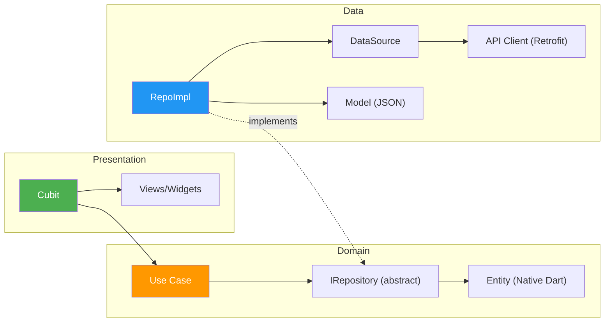

# PROJECT_CONTEXT.md

<!--
Project-specific context for سَـنَـا (Sana).
This file complements CLAUDE.md (general rules) along with CLAUDE_UI.md and CLAUDE_DATA.md with project-specific architecture, structure, and decisions.
Always read CLAUDE.md and check these specialized files when working on this project.
-->

---

# Section A — Project Identity & Infrastructure

## App Identity
- **Name**: سَـنَـا (Sana) — An Islamic companion app
- **Locale**: Arabic (`ar_EG`), RTL layout, dark theme only
- **Fonts**: Cairo (UI), UthmanTaha (Quranic text)
- **Target platforms**: Android, iOS, Web

## Key Infrastructure
| Concern | Solution |
|---|---|
| State Management | `flutter_bloc` (Cubit) |
| DI | `get_it` |
| Navigation | `go_router` (centralized registration in `core/routing/app_router.dart`) |
| Networking | `dio` + `retrofit` (code-gen) + interceptor chain |
| Local Storage | `hive_flutter` (via `ILocalStorageService`) |
| Error Modeling | Sealed `Failure` hierarchy + `Result<T>` |
| Serialization | Native Dart 3 (Sealed classes, manual JSON) |
| Asset Safety | `flutter_gen` (ALLOWED) → `Assets.images.*`, `Assets.svgs.*` |
| Cloud Database | Firebase Firestore (used in Developer Dashboard) |
| Observability | Firebase Analytics, Crashlytics, Performance |
| OTA Updates | Shorebird |
| Linting | `very_good_analysis` |
| Preview Tool | `device_preview` (Disabled by default/Dev-only) |

## Bootstrap Order
1. `main()` → `initializeApp()` — Firebase, DI, locale, orientation, global animations
2. `runApp(const SanaApp())` — first frame renders with UpdateOverlay in builder
3. `initializeAppPostFrame()` — heavy services: WorkManager, Remote Config, Religious Events, Location status management

## Feature DI Registration Order (in `service_locator.dart`)
1. `setupCoreDependencies(sl)` — Hive, Firebase, Dio, API clients, core services
2. `setupFeaturesDependencies(sl)` — All feature repos, cubits, use cases, location, qibla, etc.

---

# Section B — Architecture & Folder Structure

## 🔄 Feature Architectural Tiers

Not all features require full Clean Architecture. The project uses a **pragmatic tiered approach**:

### Tier 1 — Full Clean Architecture (3-Layer)

> `data/ → domain/ → presentation/`
> Used when the feature has **remote APIs, complex business rules, or multiple data sources**.
> **Strict Rule**: If the Domain layer is purely a pass-through (Use Cases only call Repositories without adding value/logic), it MUST be deleted and the feature downgraded to Tier 2.

| Feature | Domain Contents |
|---|---|
| `qibla` | Entities, Repository interfaces, Services, Use Cases |



### Tier 2 — Simplified Clean (2-Layer)

> `data/ → presentation/`
> Used when business logic is **straightforward** and a domain layer would be over-engineering.

| Feature |
|---|
| `quran`, `hadith_search`, `prayer`, `azkar`, `daily_content`, `home`, `asma_ul_husna`, `salat_ala_nabi`, `teaching_prayer`, `feedback`, `developer_dashboard` |

### Tier 3 — Presentation-Only

> `presentation/` only
> Used for **pure UI screens** with no data layer.

| Feature |
|---|
| `splash` |

### Tier Variant — Logic-Model-Presentation

> The `sharing` core service uses a non-standard `logic/` + `models/` + `presentation/` structure, suited for its self-contained share service logic.

---

## 📁 Complete Project Structure

```
sana/
├── 📂 core/                              # ━━━ SHARED INFRASTRUCTURE ━━━
│   ├── 📂 common/                        # Reusable UI building blocks (animations, buttons, dialogs, slivers, widgets, etc.)
│   ├── 📂 constants/                     # Centralized API endpoints, app strings, assets & fonts safety
│   ├── 📂 di/                            # Dependency Injection setup (service locator, core & features dependencies)
│   ├── 📂 error/                         # Standardized failure & error modeling
│   ├── 📂 networking/                    # Type-safe API clients, Dio factory, interceptors & error handlers
│   ├── 📂 routing/                       # GoRouter registration, routes & transitions
│   ├── 📂 services/                      # Shared business services (analytics, background workers, location, permissions, sharing, etc.)
│   ├── 📂 theme/                         # Dynamic UI styling: colors, typography, spacing, themes
│   └── 📂 utils/                         # Global helper methods (logger, date formatter, extensions)
│
├── 📂 features/                          # ━━━ FEATURE MODULES ━━━
│   ├── 📂 home/                          # Main Dashboard screen
│   ├── 📂 asma_ul_husna/                 # The 99 Beautiful Names of Allah
│   ├── 📂 azkar/                         # Daily supplications & Azkar list
│   ├── 📂 daily_content/                 # Hadith, Sunnah, and wisdom cards of the day
│   ├── 📂 hadith_search/                 # Instant Hadith search using Dorar API with caching & favorites
│   ├── 📂 prayer/                        # Prayer times calculations, settings, and timeline
│   ├── 📂 qibla/                         # Compass & GPS-based Qibla direction finder
│   ├── 📂 quran/                         # Quran recitation, surah list, and bookmarks
│   ├── 📂 salat_ala_nabi/                # Automated reminders for sending blessings upon the Prophet (ﷺ)
│   ├── 📂 splash/                        # App startup view & branding
│   ├── 📂 teaching_prayer/               # Step-by-step interactive prayer learning guide
│   ├── 📂 developer_dashboard/           # Developer/Admin panel using Firebase Firestore
│   └── 📂 feedback/                      # Feedback submission & support ticket management
│
├── 📂 assets/                            # ━━━ STATIC RESOURCE ASSETS ━━━
│   ├── 📂 audio/
│   ├── 📂 fonts/
│   ├── 📂 images/
│   ├── 📂 json/
│   └── 📂 svgs/
│
└── 📂 web/                               # Web build configurations
```

---

## 🧩 Design Patterns Catalog

### 1. Repository Pattern
Repositories abstract data access behind interfaces. The DI container wires `IHadithRepository → HadithRepoImpl`, making the presentation layer completely agnostic to data sources.

### 2. BLoC/Cubit Pattern (State Management)
- **Global Cubits**: Registered as singletons via GetIt, provided at `MaterialApp` level via `AppProviders`.
- **Feature Cubits**: Scoped per-route via `BlocProvider` in route builders.

### 3. Sealed Classes (Algebraic Data Types)
Dart 3 sealed classes ensure **compile-time exhaustiveness** — every possible result/failure type must be handled.

### 4. Factory Pattern (Dio)
Singleton factory with lazy initialization and an interceptor chain.

### 5. Interceptor Chain Pattern
Dio Request Pipeline includes: `PrettyDioLogger`, `AppHeadersInterceptor`, `PerformanceInterceptor`, and `CorsInterceptor`.

### 6. Interface Segregation (Service Abstractions)
Every core service follows `Interface → Implementation` (e.g., `ILocalStorageService` → `LocalStorageService`).

### 7. Code Generation Pipeline (MANDATORY EXCEPTIONS)
- `retrofit_generator`: Type-safe HTTP clients.
- `flutter_gen`: Type-safe asset & font references.
- `freezed` & `json_serializable`: **REMOVED** in favor of Native Dart 3.

---

# Section C — Project-Specific UI Rules

## Design Tokens (Concrete Files)
- **Colors**: Theme colors via `context.color` (defined in `MyColors` in `core/theme/style/theme/color_extension.dart`)
- **Spacing**: `AppSpacing` in `core/theme/style/app_spacing.dart`
- **Text Styles**: `AppTextStyles` in `core/theme/fonts/app_text_styles.dart`
- **Font Families**: `AppFontsFamily` in `core/theme/fonts/app_fonts_family.dart`
- **Theme**: `AppTheme` in `core/theme/style/app_theme.dart`

## Common Decorations (YOU MUST USE)
- Use `featureCardDecoration()` for feature-specific cards.
- Use `CustomAppDivider()` for all UI dividers.
- Use `customAppCardDecoration()` for primary highlighted cards.

## Common Widgets
- **Error View**: `AppErrorView`
- **Empty View**: `AppEmptyView`
- **Toast**: `AppToast`
- **Responsive Layout**: `ResponsiveWrapper`
- **Base Cards**: `DailyContentBaseCard`

---

# Section D — Project-Specific Do's/Don'ts

These are rules specifically referencing project-specific files, names, and tools. For general Flutter and data guidelines, refer to **CLAUDE_UI.md** and **CLAUDE_DATA.md**.

## ✅ DO (Project-Specific)
- **DO** use `context.color` for colors (defined in `MyColors`), and `AppSpacing`, `AppTextStyles` for styling (defined in `core/theme/`).
- **DO** use `AppStrings` for all Arabic user-facing text.
- **DO** use `Assets.images.*` / `Assets.svgs.*` for asset references (via `flutter_gen`).
- **DO** use `sl<Type>()` (GetIt service locator) for dependency resolution.
- **DO** use `AppLogger` for all logging in the app.
- **DO** register new Cubits/services in `core/di/features_di.dart`.
- **DO** follow the **"Log Once at the Source"** rule: Only call `AppLogger.error` at the absolute source (Data Layer/Repository) when catching an exception. Do NOT call `AppLogger.error` in Cubits, Use Cases, or Widgets to avoid duplicate/redundant log entries.

## ❌ DON'T (Project-Specific)
- **DON'T** bypass the centralized routing registration in `core/routing/app_router.dart`.
- **DON'T** instantiate local storage Hive boxes manually; use `ILocalStorageService` instead.
- **DON'T** log errors again in Cubits or UI layers if they have already been logged by the Repository/DataSource.

---

# Section E — Cloud & Persistence Integration

## Hybrid Data Strategy
The project employs a hybrid approach for data persistence:

### 1. Local Persistence (Hive)
- **User Settings**: Stored in `app_settings` box (Theme, Language, Prayer Calculation Method).
- **Static Content**: Azkar and 99 Names are loaded from JSON and cached if necessary.
- **Favorites**: Hadith and Daily Content favorites are stored locally using `ILocalStorageService`.

### 2. Cloud Integration (Firebase Firestore)
- **Dynamic Content**: Used for features that require real-time updates without app releases (e.g., `developer_dashboard` data).
- **Configuration**: `Firebase Remote Config` is used for feature flags and update management (`app_update`).

---

# Section F — Quality Assurance & Feature Testing

## Testing Methodology
To maintain stability, each major feature should include a testing plan:

### 1. Manual Test Scenarios
Features like `teaching_prayer` include a `testing.md` file that lists:
- **Visual Validation**: Ensuring all steps and images render correctly.
- **Edge Cases**: Handling missing content or parsing errors.

### 2. Architectural Audits
Before merging new features, an audit is performed to ensure:
- No cross-feature imports.
- Proper layer separation (no UI in data layer).
- Compliance with the Tiered Architecture rules.

