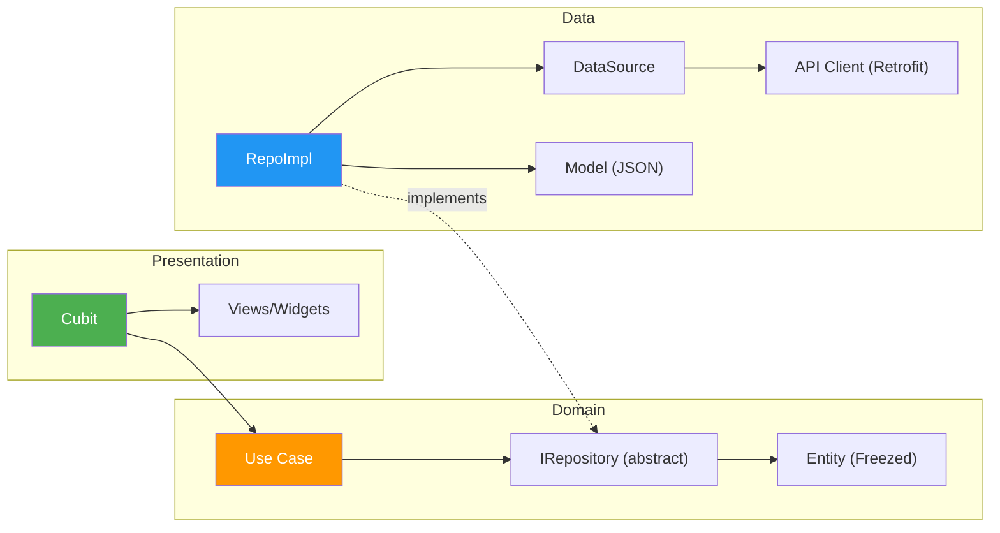
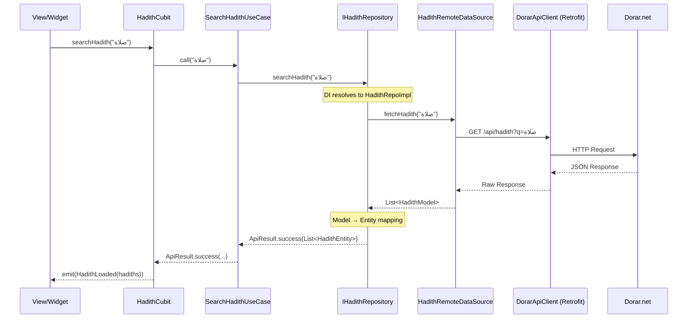
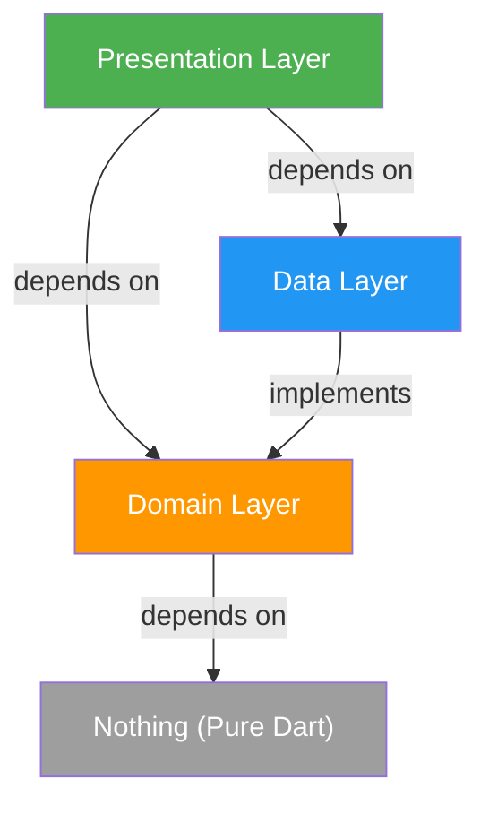

# CLAUDE.md

<!--
This file loads into context on EVERY message in this project.
Apply the Golden Test before adding any rule:
"Would removing this cause Claude to make mistakes?" If not — cut it.
Do not restate language defaults Claude already knows. Only write rules
that override defaults or encode decisions specific to this project.
-->

---

# Section A — General Engineering Rules

## 1) Architecture & Separation of Concerns (YOU MUST FOLLOW)
- Follow the project's architecture layer boundaries strictly: presentation → domain → data
- Never bypass layers or mix responsibilities
- UI/presentation layer has ZERO business logic — only rendering, interaction, and state observation
- Business logic lives in the domain layer
- Data access (APIs, databases, storage) lives in the data layer
- Do not introduce new abstractions or patterns without justification

## 2) Shared Code (IMPORTANT)
- Any reusable logic, utility, constant, extension, or helper used in 2+ places goes in `core/`
- Check `core/` before creating new shared code — never duplicate across features
- No cross-feature imports — features are isolated vertical slices

## 3) Error Handling
- Errors flow cleanly across layers — never skip layers
- Handle null, empty, loading, and error states explicitly — no silent failures
- Catch errors at the boundary (data layer), not deep inside business logic
- Use `ApiErrorHandler.handle()` for all Dio/network errors

## 4) Change Discipline
- Make the smallest change that solves the problem
- Fix root causes, not symptoms
- Don't refactor unrelated code unless explicitly requested
- Never break existing functionality, APIs, flows, or UX unless explicitly instructed
- Read relevant code before modifying it — state assumptions when unclear

## 5) Dependencies
- Don't add new packages without justification and asking the user first
- Any new package must be: latest stable, well-maintained, production-grade

## 6) Security
- Never hardcode secrets, tokens, or credentials
- Never log sensitive information
- Validate all external and API input
- Proactively flag security risks when spotted
- Firebase options live in `core/services/firebase/firebase_options.dart`

## 7) Testing
- Write tests for domain and data layer logic
- Bug fixes must include a reproducing test
- Tests must be deterministic — no flaky or timing-dependent tests
- One behavior per test case

## 8) Workflow (Mandatory)
- Before marking any task done → run the `/code-review` skill
- After task approved → run the `/create-pr` skill for branch, commit, and PR output
- PR descriptions must always be in markdown (`.md`) format

---

# Section B — Reusability (إعادة الاستخدام)

## 1) UI & Design System
- Any icon in the application MUST use colors defined in the icons section of `AppColors`.
- If a unique icon color is needed, the developer must request permission to add it to `AppColors` before implementation.
- All text styles must use `AppTextStyles` constants. Inline `TextStyle` definitions or ad-hoc overrides of `fontWeight`, `fontSize`, `color`, or `fontFamily` are strictly forbidden. Other properties (e.g., `height`, `letterSpacing`) may be modified via `.copyWith` when necessary for specific layout needs. If a core style (weight/size/color/family) is missing, it MUST be created in `AppTextStyles` first.
- **Common Decorations (YOU MUST USE)**:
  - Use `featureCardDecoration()` from `core/common/decorations/feature_card_decoration.dart` for all feature-specific cards and interactive containers.
  - Use `CustomAppDivider()` from `core/common/decorations/custom_app_divider.dart` for all UI dividers.
  - Use `customAppCardDecoration()` from `core/common/decorations/custom_app_card_decoration.dart` for primary highlighted cards (like "Anwar Al Yawm").
- **UI State Management**:
  - Each state (Loading, Success, Error) MUST be isolated into its own dedicated widget, preferably in a separate file within the feature's `widgets` folder.
  - **Loading States**: Use `Skeletonizer` to create skeleton loaders that mirror the actual Success UI.
  - **Error States**: Use `AppErrorView` for full-screen errors, or `AppToast`/`SizedBox.shrink()` for minor failures as appropriate.

## 2) Text & String Management (AppStrings)
- All user-facing Arabic text MUST be centralized in `AppStrings`. No inline Arabic strings allowed.
- **Naming Rule**: Variable names in `AppStrings` must be descriptive, unique, and match the feature or context.
- **No Aliases**: Avoid redirection/aliases within `AppStrings` (e.g., `static const String a = b;`). If a string needs to be renamed or consolidated, update all call sites across the codebase instead of creating an alias.
- **Refactoring**: When merging redundant strings, choose the most descriptive name and perform a global replacement in the project.

---

# Section C — Flutter / Dart Specific Rules

## 1) State Management
- Use **Cubit/Bloc** for feature and application state — not Riverpod, Provider, or GetX
- Cubits depend ONLY on use cases — never directly on repositories or data sources
- `setState` is allowed ONLY for local UI state (e.g., toggles, form focus) — never for business logic
- Keep `setState` scoped to the smallest widget possible to avoid redundant rebuilds up the tree

## 2) No Code Generation
- **No Freezed. No build_runner.** Use Dart 3+ native features instead:
  - `sealed class` for state unions with exhaustive pattern matching
  - `switch` expressions and records for lightweight data
- *Note: Existing files using Freezed should be maintained but new files MUST use native features.*

## 3) Domain Layer Purity
- Domain layer must have ZERO Flutter imports
- No `package:flutter/...` in any file under `domain/`

## 4) Feature Folder Structure
- `features/{feature_name}/data/`
- `features/{feature_name}/domain/`
- `features/{feature_name}/presentation/`

## 5) Error Handling Contract
- Data layer: catch exceptions and map to typed `Failure` classes via `ApiErrorHandler`
- Domain layer: return `ApiResult<T>` from use cases and repositories
- Presentation layer: map failures to user-friendly messages and UI states

## 6) Dependency Injection
- Use **`get_it`** as the service locator — not `Provider` or constructor-only injection
- Register dependencies in a single `core/di/` setup file (or feature-specific `init` methods)
- Cubits, use cases, and repositories are resolved via `get_it`, not instantiated manually

## 7) Build Method Discipline (IMPORTANT)
- Prefer `const` constructors wherever possible
- NEVER create `TextEditingController`, `AnimationController`, `FocusNode`, or other expensive objects inside `build()`
- Avoid heavy work inside `build()` methods
- Dispose controllers and focus nodes in `StatefulWidget.dispose()`
- Prefer small, composed widgets to minimize rebuild scope
- Use `BlocBuilder`/`BlocSelector` on the smallest widget that needs the state — never at the top of the tree

## 8) Performance & Hygiene (Rules)
- Use `const` for static widgets, `dispose()` for all controllers/streams, and `RepaintBoundary` for animations.

## 9) Data Transformation & Layer Purity
- Move all data transformation or parsing logic (e.g. string formatting, Regex parsing) from the UI layer to the **Data Layer (Models)**.
- Presentation widgets should be as simple and **Stateless** as possible, receiving "ready-to-render" data from models.

## 10) Strict Responsive Sizing & Typography (MANDATORY)
- **Centralized Responsiveness**: Do NOT use `.r(context)` in the UI for `AppSpacing` or `AppTextStyles`. Their responsiveness must be handled internally within their central files.
- **Explicit UI Scaling**: Use `.r(context)` in the UI only for other dimensions (e.g., icons, custom container sizes, image heights).
- **Column/Row Spacing**: NEVER use hardcoded double values for the `spacing` property in `Column` or `Row`. Always use `AppSpacing` tokens.
- **Typography Purity**: NEVER create custom `TextStyle` objects. Use `AppTextStyles` exclusively.
- **`copyWith` Restriction**: NEVER use `.copyWith` to modify `fontSize`, `fontWeight`, `color`, or `fontFamily`. Use it ONLY for secondary properties (e.g., `height` for line spacing).
- **Audit Requirement**: Every size and font must be strictly reviewed for cross-device consistency and accessibility before finalization.

---  

# Section C — Naming Conventions

## Files & Directories
| Element | Convention | Example |
|---|---|---|
| Dart files | `snake_case.dart` | `prayer_times_cubit.dart` |
| Feature folders | `snake_case` | `hadith_search/`, `salat_ala_Nabi/` |
| Data layer folders | `datasources/`, `models/`, `repos/`, `services/`, `constants/` | — |
| Domain layer folders | `entities/`, `repositories/`, `use_cases/` | — |
| Presentation folders | `cubit/`, `views/`, `widgets/`, `routes/` | — |
| Generated files | `*.g.dart`, `*.freezed.dart` | `dorar_api_client.g.dart` |
| Assets | `snake_case` in categorized folders | `assets/images/`, `assets/svgs/` |

## Classes
| Element | Convention | Example |
|---|---|---|
| Widgets / Views | `PascalCase` + `View` / `Widget` suffix | `PrayerTimesView`, `UpdateOverlay` |
| Cubits | `PascalCase` + `Cubit` suffix | `HadithCubit`, `PrayerTimesCubit` |
| States (Freezed) | `PascalCase` + `State` suffix | `HadithState`, `PrayerTimesState` |
| State variants | `Feature` + `Initial/Loading/Success/Error` | `HadithInitial`, `HadithLoading`, `HadithSuccess`, `HadithError` |
| Entities | `PascalCase` + `Entity` suffix | `HadithEntity` |
| Models (data) | `PascalCase` + `Model` suffix | `HadithModel` |
| Repositories (abstract) | `I` prefix + `PascalCase` + `Repository` | `IHadithRepository`, `IHadithFavoritesRepository` |
| Repositories (concrete) | `PascalCase` + `Impl` suffix | `HadithRepoImpl` |
| Data sources (abstract) | `I` prefix + `PascalCase` + `DataSource` | `IHadithRemoteDataSource` |
| Data sources (concrete) | `PascalCase` + `DataSource` | `HadithRemoteDataSource` |
| Use cases | `PascalCase` + `UseCase` suffix | `SearchHadithUseCase` |
| Services (abstract) | `I` prefix + `PascalCase` + `Service` | `IAnalyticsService`, `ILocalStorageService` |
| Services (concrete) | `PascalCase` + `Impl` suffix | `FirebaseAnalyticsServiceImpl` |
| DI modules | `PascalCase` + `DependencyInjection` | `HadithSearchDependencyInjection` |
| Constants classes | `App` prefix + `PascalCase` | `AppColors`, `AppSpacing`, `AppConstants`, `AppStrings` |
| Route classes | `PascalCase` + `Routes` suffix | `HomeRoutes`, `PrayerRoutes` |
| API clients | `PascalCase` + `ApiClient` suffix | `DorarApiClient`, `LocationApiClient` |
| Interceptors | `PascalCase` + `Interceptor` suffix | `CorsInterceptor`, `PerformanceInterceptor` |

## Variables & Constants
| Element | Convention | Example |
|---|---|---|
| Private fields | `_camelCase` | `_repository`, `_box` |
| Static constants | `camelCase` | `AppColors.scaffoldBackground`, `StorageKeys.hijriAdjustment` |
| Route paths | `kebab-case` strings | `'/hadith-view'`, `'/teaching-prayer'` |
| Storage keys | `snake_case` strings | `'hijri_adjustment'`, `'user_prayer_settings'` |
| Enum values | `camelCase` | — |

## Constructor Pattern
- Use private constructor `ClassName._()` for classes with only static members (prevents instantiation)
- Examples: `AppColors._()`, `AppConstants._()`, `DioFactory._()`, `ApiErrorHandler._()`, `AppSpacing._()`, `AppFontsFamily._()` (!! NOT applied to class — use `const AppFontsFamily._()` only when needed)

---

# Section D — Error Handling (Deep Dive)

## Error Flow Diagram

```
Network/API Error
    ↓
[Data Layer] DioException caught → ApiErrorHandler.handle() → typed Failure
    ↓
[Repository] wraps in ApiResult.failure(failure)
    ↓
[Use Case] passes through ApiResult<T> unchanged
    ↓
[Cubit] pattern-matches on ApiResult → emits UI state
    ↓
[Widget] renders error view with user-friendly message from AppStrings
```

## Failure Hierarchy (sealed class in `core/error/failure.dart`)
```
Failure (sealed)
├── ServerFailure       → API returned non-success status code
├── NetworkFailure      → No internet / timeout / connection error
├── CacheFailure        → Local storage read/write failure
├── LocationFailure     → GPS / geocoding failure
├── SensorFailure       → Compass / sensor unavailable
├── WrongPasswordFailure → Authentication error
├── MissingDataFailure  → Required data not found
└── UnknownFailure      → Catch-all for unexpected errors
```

## Rules
- Never throw raw exceptions from the data layer — always map to `Failure`
- Never show raw exception messages to the user — map via `AppStrings`
- Every `ApiResult.failure` must carry a `Failure` with a user-friendly `message`
- Use `AppLogger.error()` for all error logging — it routes to console (debug) or Crashlytics (release)
- Catch at the outermost boundary only — don't swallow errors in nested functions
- Always handle all 4 UI states in presentation: `initial`, `loading`, `success`, `error`

---

# Section E — Do's and Don'ts

## ✅ DO

- **DO** follow the existing architecture — don't invent new patterns
- **DO** check `core/` before writing any shared utility, extension, or widget
- **DO** use `AppColors`, `AppSpacing`, `AppTextStyles` for all styling — no hardcoded values
- **DO** use `AppStrings` for all Arabic user-facing text — no inline strings
- **DO** use `Assets.images.*` / `Assets.svgs.*` from `flutter_gen` for asset references
- **DO** use `sl<Type>()` from GetIt for dependency resolution
- **DO** use `const` constructors wherever possible
- **DO** dispose all controllers, streams, and subscriptions in `dispose()`
- **DO** use `AppLogger` for all logging — never use `print()` or `debugPrint()`
- **DO** return `ApiResult<T>` from repositories and use cases
- **DO** use the existing `ResponsiveWrapper` for responsive layout
- **DO** handle RTL layout globally via localization — don't add manual RTL overrides
- **DO** test on both mobile and web when making UI changes
- **DO** use `unawaited()` for intentionally fire-and-forget futures to avoid blocking and ensure predictable execution flow.
- **DO** use `package:` imports for ALL files within the `lib` directory. Relative imports are strictly forbidden to ensure consistency and avoid linting errors.
- **DO** avoid unnecessary type annotations on local variables. Use `final` or `var` for inference to keep the code clean and concise.
- **DO** prefix abstract interfaces with `I` (e.g., `IHadithRepository`).
- **DO** register new Cubits/services in `core/di/features_di.dart`.
- **Haptics**: Use `unawaited(AppFeedback.playVibrate())` for standard interactions and `playDoubleVibrate()` for significant actions/success/errors.

## ❌ DON'T

- **DON'T** add any new package without asking the user first — always justify the need
- **DON'T** write comments in code — the code should be self-documenting; use clear naming instead 
- **DON'T** use `print()` or `debugPrint()` — use `AppLogger` exclusively
- **DON'T** hardcode colors, spacing, or font sizes — use design tokens from `core/theme/`
- **DON'T** hardcode Arabic strings — add them to `AppStrings`
- **DON'T** import from one feature into another — features are isolated
- **DON'T** put business logic in widgets or `build()` methods
- **DON'T** create `TextEditingController` / `FocusNode` / `AnimationController` inside `build()`
- **DON'T** use `Provider`, `Riverpod`, `GetX`, or any state management other than Cubit/Bloc
- **DON'T** use `setState` for anything beyond trivial local UI toggles
- **DON'T** bypass the `Failure` → `ApiResult` error handling chain
- **DON'T** throw raw exceptions from repositories or data sources
- **DON'T** swallow errors silently — always log and surface to the user
- **DON'T** add Flutter imports to the domain layer
- **DON'T** use magic numbers — extract to named constants in `AppSpacing` or feature constants
- **DON'T** duplicate code — if you need it twice, move it to `core/`
- **DON'T** modify generated files (`*.g.dart`, `*.freezed.dart`, `assets.gen.dart`) manually
- **DON'T** skip the DI system — never `new` up a Cubit, repo, or service manually
- **DON'T** refactor unrelated code while fixing a bug or adding a feature
- **DON'T** log sensitive user data (location coordinates, device IDs in production)

---

# Section F — Project-Specific Context

## App Identity
- **Name**: سَـنَـا (Sana) — An Islamic companion app
- **Locale**: Arabic (`ar_EG`), RTL layout, dark theme only
- **Fonts**: Cairo (UI), UthmanTaha (Quranic text)
- **Target platforms**: Android, iOS, Web

## Key Infrastructure
| Concern | Solution |
|---|---|
| State Management | `flutter_bloc` (Cubit) |
| DI | `get_it` |
| Navigation | `go_router` (centralized registration in `core/routing/app_router.dart`) |
| Networking | `dio` + `retrofit` (code-gen) + interceptor chain |
| Local Storage | `hive_flutter` (via `ILocalStorageService`) |
| Error Modeling | Sealed `Failure` hierarchy + `ApiResult<T>` |
| Serialization | `freezed` + `json_serializable` (legacy), Dart 3 sealed for new code |
| Asset Safety | `flutter_gen` → `Assets.images.*`, `Assets.svgs.*` |
| Observability | Firebase Analytics, Crashlytics, Performance |
| OTA Updates | Shorebird |
| Linting | `very_good_analysis` |

## Bootstrap Order
1. `main()` → `initializeApp()` — Firebase, DI, locale, orientation (parallel)
2. `runApp(SanaApp())` — first frame renders
3. `initializeAppPostFrame()` — heavy services: WorkManager, Remote Config, Location warm-up

## Feature DI Registration Order (in `service_locator.dart`)
1. `setupCoreDependencies(sl)` — Hive, Firebase, Dio, API clients, core services
2. `setupLocationDependencies(sl)` — Location repos & cubits

---

# Section G — Architecture Documentation

## 📁 Complete Folder Structure

```
sana/
├── 📄 main.dart                          # App entry point, bootstrap & SanaApp widget
│
├── 📂 core/                              # ━━━ SHARED INFRASTRUCTURE ━━━
│   ├── 📂 common/                        # Reusable UI building blocks
│   │   ├── 📂 animations/                # AppAnimations, PressScaleWidget
│   │   ├── 📂 buttons/                   # AppButtons, ArrowBackButton, SearchIconButton
│   │   ├── 📂 decorations/               # AppCardDecoration, AppDivider
│   │   ├── 📂 favorites/                 # FavoriteToggleButton, NoFavoritesYet
│   │   ├── 📂 layout/                    # ResponsiveWrapper, CustomCarouselSlider
│   │   ├── 📂 overlays/                  # Bottom sheets, Dialogs, Toasts
│   │   │   ├── 📂 bottom_sheet/
│   │   │   ├── 📂 dialog/
│   │   │   └── 📂 toast/
│   │   ├── 📂 slivers/                   # AnimatedSliverList, CommonSliverAppBar
│   │   └── 📂 widgets/                   # AppEmptyView, AppErrorView, NotFoundView
│   │
│   ├── 📂 constants/                     # App-wide constants
│   │   ├── 📄 api_endpoints.dart         # API base URLs & endpoints
│   │   ├── 📄 app_constants.dart         # Locale, country code
│   │   ├── 📄 app_links.dart             # External URLs (Play Store, social, etc.)
│   │   ├── 📄 app_strings.dart           # All Arabic UI strings (centralized)
│   │   └── 📂 generated/                 # flutter_gen output
│   │       ├── 📄 assets.gen.dart        # Type-safe asset references
│   │       └── 📄 fonts.gen.dart         # Type-safe font family references
│   │
│   ├── 📂 di/                            # Dependency Injection orchestration
│   │   ├── 📄 service_locator.dart       # GetIt instance + initializeApp() bootstrap
│   │   ├── 📄 app_providers.dart         # MultiBlocProvider (global Cubits)
│   │   ├── 📄 core_di.dart              # Core services registration (Dio, Hive, Firebase, etc.)
│   │   ├── 📄 location_di.dart           # Location-related DI
│   │   ├── 📄 qibla_di.dart             # Qibla-related DI
│   │   └── 📄 other_features_di.dart     # Misc feature DI
│   │
│   ├── 📂 error/                         # Failure modeling
│   │   ├── 📄 failure.dart               # Sealed Failure hierarchy (Server, Network, Cache, etc.)
│   │   └── 📄 failure.freezed.dart       # Freezed generated code
│   │
│   ├── 📂 networking/                    # HTTP client infrastructure
│   │   ├── 📄 dio_factory.dart           # Singleton Dio with interceptors (Factory pattern)
│   │   ├── 📄 api_result.dart            # Sealed ApiResult<T> (Success | Failure)
│   │   ├── 📄 api_result.freezed.dart    # Freezed generated code
│   │   ├── 📄 api_error_handler.dart     # DioException → Failure mapper
│   │   ├── 📄 app_headers_interceptor.dart
│   │   ├── 📄 cors_interceptor.dart
│   │   ├── 📄 performance_interceptor.dart
│   │   └── 📂 api_clients/               # Retrofit-generated type-safe API clients
│   │       ├── 📄 dorar_api_client.dart           # Dorar Hadith API
│   │       ├── 📄 dorar_api_client.g.dart
│   │       ├── 📄 location_api_client.dart        # OpenStreetMap Nominatim API
│   │       └── 📄 location_api_client.g.dart
│   │
│   ├── 📂 routing/                       # Navigation
│   │   ├── 📄 app_router.dart            # GoRouter config (aggregates all feature routes)
│   │   ├── 📄 app_routes.dart            # Route path constants
│   │   └── 📄 app_transitions.dart       # Custom page transitions
│   │
│   ├── 📂 services/                      # Platform & third-party service abstractions
│   │   ├── 📂 analytics/
│   │   ├── 📂 app_date/                      # 📅 Hijri date management
│   │   ├── 📂 app_update/                    # 🔄 Force/optional update flow
│   │   ├── 📂 device_info/
│   │   ├── 📂 firebase/
│   │   ├── 📂 local_storage/
│   │   ├── 📂 location_manager/              # 📍 Location permissions & GPS
│   │   ├── 📂 permissions/
│   │   └── 📂 sharing/                       # 📤 Screenshot & share logic
│   │
│   ├── 📂 theme/                         # Design system tokens
│   │   ├── 📂 fonts/
│   │   │   ├── 📄 app_fonts_family.dart           # Font family constants
│   │   │   └── 📄 app_text_styles.dart            # Centralized TextStyle definitions
│   │   └── 📂 style/
│   │       ├── 📄 app_colors.dart                 # Color palette
│   │       ├── 📄 app_spacing.dart                # Spacing tokens (padding, margin)
│   │       └── 📄 app_theme.dart                  # ThemeData (dark theme)
│   │
│   └── 📂 utils/                         # Utility helpers
│       ├── 📄 app_date_formatter.dart
│       ├── 📄 app_feedback.dart           # Haptic/toast feedback helpers
│       ├── 📄 app_logger.dart             # Logger wrapper
│       ├── 📄 bloc_observer.dart          # AppBlocObserver (dev debugging)
│       ├── 📄 regex.dart                  # Regex patterns
│       └── 📄 version_utils.dart          # Version comparison logic
│
└── 📂 features/                          # ━━━ FEATURE MODULES ━━━
    │
    ├── 📂 home/                          # 🏠 Home screen & navigation hub
    │   ├── 📂 data/
    │   └── 📂 presentation/
    │
    ├── 📂 prayer/                        # 🕌 Prayer times & Islamic events
    │   ├── 📂 data/
    │   │   ├── 📂 constants/
    │   │   ├── 📂 models/
    │   │   ├── 📂 repos/
    │   │   └── 📂 services/
    │   └── 📂 presentation/
    │       ├── 📂 cubit/
    │       ├── 📂 views/
    │       └── 📂 widgets/
    │
    ├── 📂 quran/                         # 📖 Quran reader & tafsir
    │   ├── 📂 data/
    │   └── 📂 presentation/
    │
    ├── 📂 azkar/                         # 📿 Dhikr / Azkar collection
    │   ├── 📂 data/
    │   └── 📂 presentation/
    │
    ├── 📂 hadith_search/                 # 📚 Hadith search (FULL Clean Architecture)
    │   ├── 📂 data/
    │   │   ├── 📂 constants/
    │   │   ├── 📂 datasources/           # IHadithRemoteDataSource + impl
    │   │   ├── 📂 models/
    │   │   ├── 📂 repos/                 # HadithRepoImpl, HadithFavoritesRepoImpl
    │   │   └── 📂 utils/
    │   ├── 📂 domain/                    # ⭐ Full domain layer
    │   │   ├── 📂 entities/              # HadithEntity (Freezed)
    │   │   ├── 📂 repositories/          # IHadithRepository, IHadithFavoritesRepository
    │   │   └── 📂 use_cases/             # SearchHadithUseCase
    │   └── 📂 presentation/
    │       ├── 📂 cubit/
    │       │   ├── 📂 hadith_favorites/
    │       │   └── 📂 hadith_search/
    │       ├── 📂 views/
    │       └── 📂 widgets/
    │
    ├── 📂 daily_content/                 # 🌟 Daily Hadith, Sunnah, Name of Allah
    │   ├── 📂 data/
    │   └── 📂 presentation/
    │
    ├── 📂 qibla/                         # 🧭 Qibla compass
    │   ├── 📂 data/
    │   └── 📂 presentation/
    │
    ├── 📂 asma_ul_husna/                 # ✨ 99 Names of Allah
    │   ├── 📂 data/
    │   └── 📂 presentation/
    │
    ├── 📂 salat_ala_Nabi/                # 🤲 Salat ala Nabi reminders
    │   ├── 📂 data/
    │   └── 📂 presentation/
    │
    ├── 📂 teaching_prayer/               # 📐 Visual prayer tutorial
    │   ├── 📂 constants/
    │   │   └── 📄 teaching_prayer_keys.dart
    │   ├── 📂 data/
    │   │   ├── 📂 datasources/
    │   │   │   └── 📄 teaching_prayer_local_data_source.dart
    │   │   ├── 📂 models/
    │   │   │   └── 📄 teaching_prayer_model.dart
    │   │   └── 📂 repos/
    │   │       └── 📄 teaching_prayer_repo_impl.dart
    │   ├── 📂 presentation/
    │   │   ├── 📂 cubit/
    │   │   │   ├── 📄 teaching_prayer_cubit.dart
    │   │   │   └── 📄 teaching_prayer_state.dart
    │   │   ├── 📂 views/
    │   │   │   └── 📄 teaching_prayer_view.dart
    │   │   └── 📂 widgets/
    │   │       ├── 📄 teaching_prayer_error_widget.dart
    │   │       ├── 📄 teaching_prayer_loading_widget.dart
    │   │       ├── 📄 teaching_prayer_success_widget.dart
    │   │       ├── 📄 teaching_section_card.dart
    │   │       └── 📄 teaching_topic_card.dart
    │   ├── 📂 utils/
    │   │   └── 📄 teaching_content_parser.dart
    │   └── 📄 teaching_prayer_testing.md
    │
    ├── 📂 feedback/                      # 💬 User feedback (Google Forms)
    │   ├── 📂 data/
    │   └── 📂 presentation/
    │
    ├── 📂 splash/                        # 🎬 Splash screen
    │   └── 📂 presentation/
    │
    └── 📂 developer_dashboard/           # 🛠️ Dev tools dashboard
        ├── 📂 data/
        └── 📂 presentation/
```

### Assets Structure

```
assets/
├── 📂 audio/          # Audio files (reciters, reminders)
├── 📂 fonts/          # Custom font families
│   ├── 📂 cairo/      # Cairo (Arabic UI — weights 200–900)
│   └── 📂 uthman/     # UthmanTaha (Quranic typography)
├── 📂 images/         # Raster images (PNG/JPG)
├── 📂 json/           # Static JSON data (Azkar, names, etc.)
└── 📂 svgs/           # Vector illustrations & icons
```

---

## 🔄 Feature Architectural Tiers

Not all features require full Clean Architecture. The project uses a **pragmatic tiered approach**:

### Tier 1 — Full Clean Architecture (3-Layer)

> `data/ → domain/ → presentation/`
> Used when the feature has **remote APIs, complex business rules, or multiple data sources**.

| Feature | Domain Contents |
|---|---|
| `hadith_search` | Entities, Repository interfaces, Use Cases |



### Tier 2 — Simplified Clean (2-Layer)

> `data/ → presentation/`
> Used when business logic is **straightforward** and a domain layer would be over-engineering.

| Feature |
|---|
| `prayer`, `quran`, `azkar`, `daily_content`, `home`, `qibla`, `asma_ul_husna`, `salat_ala_Nabi`, `teaching_prayer`, `feedback`, `developer_dashboard` |

### Tier 3 — Presentation-Only

> `presentation/` only
> Used for **pure UI screens** with no data layer.

| Feature |
|---|
| `splash` |

### Tier Variant — Logic-Model-Presentation

> The `sharing` feature uses a non-standard `logic/` + `models/` + `presentation/` structure, suited for its self-contained share service logic.

---

## 🧩 Design Patterns Catalog


### 2. Repository Pattern

```dart
// Domain (abstract contract)
abstract class IHadithRepository {
  Future<ApiResult<List<HadithEntity>>> searchHadith(String query, {int page = 1});
}

// Data (concrete implementation)
class HadithRepoImpl implements IHadithRepository { ... }
```

> Repositories abstract data access behind interfaces. The DI container wires `IHadithRepository → HadithRepoImpl`, making the presentation layer completely agnostic to data sources.

### 3. BLoC/Cubit Pattern (State Management)

```dart
// Global Cubits injected at app root
MultiBlocProvider(
  providers: [
    BlocProvider(create: (_) => sl<LocationCubit>()),
    BlocProvider(create: (_) => sl<AppDateCubit>()),
    BlocProvider(create: (_) => sl<PrayerTimesCubit>()),
    BlocProvider(create: (_) => sl<AppUpdateCubit>()),
  ],
)
```

> - **Global Cubits**: Registered as singletons via GetIt, provided at `MaterialApp` level via `AppProviders`
> - **Feature Cubits**: Scoped per-route via `BlocProvider` in route builders

### 4. Sealed Classes (Algebraic Data Types)

```dart
// ApiResult — exhaustive pattern matching
sealed class ApiResult<T> {
  const factory ApiResult.success(T data) = Success<T>;
  const factory ApiResult.failure(Failure failure) = ApiFailure<T>;
}

// Failure — typed error hierarchy
sealed class Failure {
  const factory Failure.server({required String message, int? statusCode}) = ServerFailure;
  const factory Failure.network({required String message}) = NetworkFailure;
  const factory Failure.cache({required String message}) = CacheFailure;
  const factory Failure.location({required String message}) = LocationFailure;
  const factory Failure.sensor({required String message}) = SensorFailure;
  // ...
}
```

> Dart 3 sealed classes ensure **compile-time exhaustiveness** — every possible result/failure type must be handled.

### 5. Factory Pattern (Dio)

```dart
class DioFactory {
  DioFactory._();
  static Dio? _dio;

  static Dio getDio() {
    if (_dio == null) {
      _dio = Dio();
      _addDioInterceptors();
    }
    return _dio!;
  }
}
```

> Singleton factory with lazy initialization and an interceptor chain.

### 6. Interceptor Chain Pattern

```
Dio Request Pipeline:
  ┌──────────────────────────────┐
  │  PrettyDioLogger (debug only)│
  ├──────────────────────────────┤
  │  AppHeadersInterceptor       │
  ├──────────────────────────────┤
  │  PerformanceInterceptor      │  ← Firebase Performance traces
  ├──────────────────────────────┤
  │  CorsInterceptor             │  ← Web platform CORS handling
  └──────────────────────────────┘
```

### 7. Interface Segregation (Service Abstractions)

Every core service follows `Interface → Implementation`:

| Interface | Implementation |
|---|---|
| `IAnalyticsService` | `FirebaseAnalyticsServiceImpl` |
| `IDeviceInfoService` | `DeviceInfoServiceImpl` |
| `IAppPermissionsManager` | `AppPermissionsManagerImpl` |
| `ILocalStorageService` | `LocalStorageService` (Hive) |
| `IHadithRemoteDataSource` | `HadithRemoteDataSource` |

### 8. Code Generation Pipeline

| Tool | Purpose |
|---|---|
| `freezed` | Immutable data classes, sealed unions, `copyWith()` |
| `json_serializable` | JSON ↔ Model serialization |
| `retrofit_generator` | Type-safe HTTP clients from annotations |
| `flutter_gen` | Type-safe asset & font references (`Assets.images.x`) |

### 9. Centralized Route Registration

```dart
class AppRouter {
  static final GoRouter router = GoRouter(
    routes: [
      GoRoute(path: '/splash', ...),
      GoRoute(path: '/home', ...),
      // All routes are defined directly in this file to maintain central visibility
    ],
  );
}
```

> All routes are defined in `lib/core/routing/app_router.dart`. This ensures a single source of truth for navigation paths and transitions.

### 10. Two-Phase Bootstrap

```dart
void main() async {
  WidgetsFlutterBinding.ensureInitialized();
  await initializeApp();         // Phase 1: Critical (Firebase, DI, locale)
  runApp(const SanaApp());
  await initializeAppPostFrame(); // Phase 2: Heavy services (after first frame)
}
```

> Critical services load before `runApp()`. Heavy services (WorkManager, Remote Config, Location warm-up) are deferred post-first-frame to minimize splash screen duration.

---

## 📊 Data Flow (End-to-End Example)



---

## 🔐 Layer Dependency Matrix

| Layer | Can Depend On | Cannot Depend On |
|---|---|---|
| **Presentation** | Domain, Core (theme, routing, common) | Data layer directly |
| **Domain** | Nothing (pure Dart) | Core, Presentation, Data, Flutter SDK |
| **Data** | Domain (implements interfaces), Core (networking, storage) | Presentation |
| **Core** | Flutter SDK, third-party packages | Features |
| **Features** | Core | Other features (no cross-feature imports) |

### Layer Dependency Diagram


