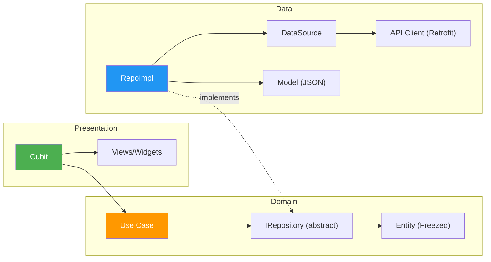
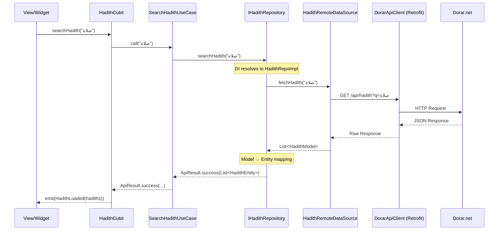
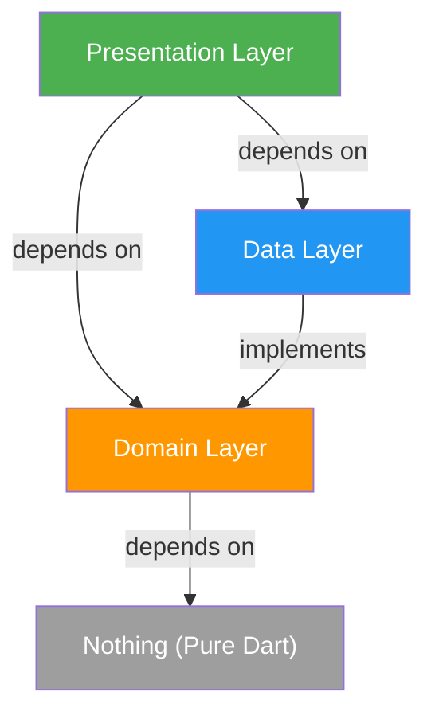

# PROJECT_CONTEXT.md

<!--
Project-specific context for سَـنَـا (Sana).
This file complements CLAUDE.md (general rules) with project-specific architecture, structure, and decisions.
Always read both CLAUDE.md and this file when working on this project.
-->

---

# Section A — Project Identity & Infrastructure

## App Identity
- **Name**: سَـنَـا (Sana) — An Islamic companion app
- **Locale**: Arabic (`ar_EG`), RTL layout, dark theme only
- **Fonts**: Cairo (UI), UthmanTaha (Quranic text)
- **Target platforms**: Android, iOS, Web

## Key Infrastructure
| Concern | Solution |
|---|---|
| State Management | `flutter_bloc` (Cubit) |
| DI | `get_it` |
| Navigation | `go_router` (centralized registration in `core/routing/app_router.dart`) |
| Networking | `dio` + `retrofit` (code-gen) + interceptor chain |
| Local Storage | `hive_flutter` (via `ILocalStorageService`) |
| Error Modeling | Sealed `Failure` hierarchy + `ApiResult<T>` |
| Serialization | `freezed` + `json_serializable` (legacy), Dart 3 sealed for new code |
| Asset Safety | `flutter_gen` → `Assets.images.*`, `Assets.svgs.*` |
| Observability | Firebase Analytics, Crashlytics, Performance |
| OTA Updates | Shorebird |
| Linting | `very_good_analysis` |

## Bootstrap Order
1. `main()` → `initializeApp()` — Firebase, DI, locale, orientation (parallel)
2. `runApp(SanaApp())` — first frame renders
3. `initializeAppPostFrame()` — heavy services: WorkManager, Remote Config, Location warm-up

## Feature DI Registration Order (in `service_locator.dart`)
1. `setupCoreDependencies(sl)` — Hive, Firebase, Dio, API clients, core services
2. `setupFeaturesDependencies(sl)` — All feature repos, cubits, use cases, location, qibla, etc.

---

# Section B — Architecture Documentation

## 📁 Complete Folder Structure

```
sana/
├── 📄 main.dart                          # App entry point, bootstrap & SanaApp widget
│
├── 📂 core/                              # ━━━ SHARED INFRASTRUCTURE ━━━
│   ├── 📂 common/                        # Reusable UI building blocks
│   │   ├── 📂 animations/                # AppAnimations, PressScaleWidget
│   │   ├── 📂 buttons/                   # AppButtons, ArrowBackButton, SearchIconButton
│   │   ├── 📂 decorations/               # AppCardDecoration, AppDivider
│   │   ├── 📂 favorites/                 # FavoriteToggleButton, NoFavoritesYet
│   │   ├── 📂 layout/                    # ResponsiveWrapper, CustomCarouselSlider
│   │   ├── 📂 overlays/                  # Bottom sheets, Dialogs, Toasts
│   │   │   ├── 📂 bottom_sheet/
│   │   │   ├── 📂 dialog/
│   │   │   └── 📂 toast/
│   │   ├── 📂 slivers/                   # AnimatedSliverList, CommonSliverAppBar
│   │   └── 📂 widgets/                   # AppArrowIcon, AppEmptyView, AppErrorView, AppToggleList, NotFoundView
│   │
│   ├── 📂 constants/                     # App-wide constants
│   │   ├── 📄 api_endpoints.dart         # API base URLs & endpoints
│   │   ├── 📄 app_constants.dart         # Locale, country code
│   │   ├── 📄 app_links.dart             # External URLs (Play Store, social, etc.)
│   │   ├── 📄 app_strings.dart           # All Arabic UI strings (centralized)
│   │   └── 📂 generated/                 # flutter_gen output
│   │       ├── 📄 assets.gen.dart        # Type-safe asset references
│   │       └── 📄 fonts.gen.dart         # Type-safe font family references
│   │
│   ├── 📂 di/                            # Dependency Injection orchestration
│   │   ├── 📄 service_locator.dart       # GetIt instance + initializeApp() bootstrap
│   │   ├── 📄 core_di.dart              # Core services registration (Dio, Hive, Firebase, etc.)
│   │   └── 📄 features_di.dart          # All feature dependencies (repos, cubits, use cases)
│   │
│   ├── 📂 error/                         # Failure modeling
│   │   └── 📄 failure.dart               # Sealed Failure hierarchy (native Dart 3 sealed class)
│   │
│   ├── 📂 networking/                    # HTTP client infrastructure
│   │   ├── 📄 dio_factory.dart           # Singleton Dio with interceptors (Factory pattern)
│   │   ├── 📄 api_result.dart            # Sealed ApiResult<T> (Success | Failure)
│   │   ├── 📄 api_error_handler.dart     # DioException → Failure mapper
│   │   ├── 📄 app_headers_interceptor.dart
│   │   ├── 📄 cors_interceptor.dart
│   │   ├── 📄 performance_interceptor.dart
│   │   └── 📂 api_clients/               # Retrofit-generated type-safe API clients
│   │       ├── 📄 dorar_api_client.dart           # Dorar Hadith API
│   │       ├── 📄 dorar_api_client.g.dart
│   │       ├── 📄 location_api_client.dart        # OpenStreetMap Nominatim API
│   │       └── 📄 location_api_client.g.dart
│   │
│   ├── 📂 routing/                       # Navigation
│   │   ├── 📄 app_router.dart            # GoRouter config (aggregates all feature routes)
│   │   ├── 📄 app_routes.dart            # Route path constants
│   │   └── 📄 app_transitions.dart       # Custom page transitions
│   │
│   ├── 📂 services/                      # Platform & third-party service abstractions
│   │   ├── 📂 analytics/
│   │   ├── 📂 app_date/                      # 📅 Hijri date management
│   │   ├── 📂 app_update/                    # 🔄 Force/optional update flow
│   │   ├── 📂 background/                    # ⏱️ WorkManager background tasks
│   │   ├── 📂 device_info/
│   │   ├── 📂 firebase/
│   │   ├── 📂 local_storage/
│   │   ├── 📂 location_manager/              # 📍 Location permissions & GPS
│   │   ├── 📂 notification/                  # 🔔 Local notifications service
│   │   ├── 📂 permissions/
│   │   └── 📂 sharing/                       # 📤 Screenshot & share logic
│   │
│   ├── 📂 theme/                         # Design system tokens
│   │   ├── 📂 fonts/
│   │   │   ├── 📄 app_fonts_family.dart           # Font family constants
│   │   │   └── 📄 app_text_styles.dart            # Centralized TextStyle definitions
│   │   └── 📂 style/
│   │       ├── 📄 app_colors.dart                 # Color palette
│   │       ├── 📄 app_spacing.dart                # Spacing tokens (padding, margin)
│   │       └── 📄 app_theme.dart                  # ThemeData (dark theme)
│   │
│   └── 📂 utils/                         # Utility helpers
│       ├── 📄 app_date_formatter.dart
│       ├── 📄 app_feedback.dart           # Haptic/toast feedback helpers
│       ├── 📄 app_logger.dart             # Logger wrapper
│       ├── 📄 bloc_observer.dart          # AppBlocObserver (dev debugging)
│       ├── 📄 context_extension.dart      # BuildContext extensions
│       ├── 📄 regex.dart                  # Regex patterns
│       └── 📄 version_utils.dart          # Version comparison logic
│
└── 📂 features/                          # ━━━ FEATURE MODULES ━━━
    │
    ├── 📂 home/                          # 🏠 Home screen & navigation hub
    │   ├── 📂 data/
    │   └── 📂 presentation/
    │
    ├── 📂 prayer/                        # 🕌 Prayer times & Islamic events
    │   ├── 📂 data/
    │   │   ├── 📂 constants/
    │   │   ├── 📂 models/
    │   │   ├── 📂 repos/
    │   │   └── 📂 services/
    │   └── 📂 presentation/
    │       ├── 📂 cubit/
    │       ├── 📂 views/
    │       └── 📂 widgets/
    │
    ├── 📂 quran/                         # 📖 Quran reader & tafsir
    │   ├── 📂 data/
    │   ├── 📂 domain/                    # ⭐ Full domain layer (use cases)
    │   └── 📂 presentation/
    │
    ├── 📂 azkar/                         # 📿 Dhikr / Azkar collection
    │   ├── 📂 data/
    │   └── 📂 presentation/
    │
    ├── 📂 hadith_search/                 # 📚 Hadith search (FULL Clean Architecture)
    │   ├── 📂 data/
    │   │   ├── 📂 constants/
    │   │   ├── 📂 datasources/           # IHadithRemoteDataSource + impl
    │   │   ├── 📂 models/
    │   │   ├── 📂 repos/                 # HadithRepoImpl, HadithFavoritesRepoImpl
    │   │   └── 📂 utils/
    │   ├── 📂 domain/                    # ⭐ Full domain layer
    │   │   ├── 📂 entities/              # HadithEntity (Freezed)
    │   │   ├── 📂 repositories/          # IHadithRepository, IHadithFavoritesRepository
    │   │   └── 📂 use_cases/             # SearchHadithUseCase
    │   └── 📂 presentation/
    │       ├── 📂 cubit/
    │       │   ├── 📂 hadith_favorites/
    │       │   └── 📂 hadith_search/
    │       ├── 📂 views/
    │       └── 📂 widgets/
    │
    ├── 📂 daily_content/                 # 🌟 Daily Hadith, Sunnah, Name of Allah
    │   ├── 📂 data/
    │   └── 📂 presentation/
    │
    ├── 📂 qibla/                         # 🧭 Qibla compass (FULL Clean Architecture)
    │   ├── 📂 data/
    │   ├── 📂 domain/                    # ⭐ Full domain layer (entities, repos, services, use cases)
    │   └── 📂 presentation/
    │
    ├── 📂 asma_ul_husna/                 # ✨ 99 Names of Allah
    │   ├── 📂 data/
    │   └── 📂 presentation/
    │
    ├── 📂 salat_ala_nabi/                # 🤲 Salat ala Nabi reminders
    │   ├── 📂 data/
    │   └── 📂 presentation/
    │
    ├── 📂 teaching_prayer/               # 📐 Visual prayer tutorial
    │   ├── 📂 constants/
    │   │   └── 📄 teaching_prayer_keys.dart
    │   ├── 📂 data/
    │   │   ├── 📂 datasources/
    │   │   │   └── 📄 teaching_prayer_local_data_source.dart
    │   │   ├── 📂 models/
    │   │   │   └── 📄 teaching_prayer_model.dart
    │   │   └── 📂 repos/
    │   │       └── 📄 teaching_prayer_repo_impl.dart
    │   ├── 📂 presentation/
    │   │   ├── 📂 cubit/
    │   │   │   ├── 📄 teaching_prayer_cubit.dart
    │   │   │   └── 📄 teaching_prayer_state.dart
    │   │   ├── 📂 views/
    │   │   │   └── 📄 teaching_prayer_view.dart
    │   │   └── 📂 widgets/
    │   │       ├── 📄 teaching_prayer_error_widget.dart
    │   │       ├── 📄 teaching_prayer_loading_widget.dart
    │   │       ├── 📄 teaching_prayer_success_widget.dart
    │   │       ├── 📄 teaching_section_card.dart
    │   │       └── 📄 teaching_topic_card.dart
    │   ├── 📂 utils/
    │   │   └── 📄 teaching_content_parser.dart
    │   └── 📄 teaching_prayer_testing.md
    │
    ├── 📂 feedback/                      # 💬 User feedback (Google Forms)
    │   ├── 📂 data/
    │   └── 📂 presentation/
    │
    ├── 📂 splash/                        # 🎬 Splash screen
    │   └── 📂 presentation/
    │
    └── 📂 developer_dashboard/           # 🛠️ Dev tools dashboard
        ├── 📂 data/
        └── 📂 presentation/
```

### Assets Structure

```
assets/
├── 📂 audio/          # Audio files (reciters, reminders)
├── 📂 fonts/          # Custom font families
│   ├── 📂 cairo/      # Cairo (Arabic UI — weights 200–900)
│   └── 📂 uthman/     # UthmanTaha (Quranic typography)
├── 📂 images/         # Raster images (PNG/JPG)
├── 📂 json/           # Static JSON data (Azkar, names, etc.)
└── 📂 svgs/           # Vector illustrations & icons
```

---

## 🔄 Feature Architectural Tiers

Not all features require full Clean Architecture. The project uses a **pragmatic tiered approach**:

### Tier 1 — Full Clean Architecture (3-Layer)

> `data/ → domain/ → presentation/`
> Used when the feature has **remote APIs, complex business rules, or multiple data sources**.
> **Strict Rule**: If the Domain layer is purely a pass-through (Use Cases only call Repositories without adding value/logic), it MUST be deleted and the feature downgraded to Tier 2.

| Feature | Domain Contents |
|---|---|
| `qibla` | Entities, Repository interfaces, Services, Use Cases |
| `quran` | Use Cases |



### Tier 2 — Simplified Clean (2-Layer)

> `data/ → presentation/`
> Used when business logic is **straightforward** and a domain layer would be over-engineering.

| Feature |
|---|
| `hadith_search`, `prayer`, `azkar`, `daily_content`, `home`, `asma_ul_husna`, `salat_ala_nabi`, `teaching_prayer`, `feedback`, `developer_dashboard` |

### Tier 3 — Presentation-Only

> `presentation/` only
> Used for **pure UI screens** with no data layer.

| Feature |
|---|
| `splash` |

### Tier Variant — Logic-Model-Presentation

> The `sharing` feature uses a non-standard `logic/` + `models/` + `presentation/` structure, suited for its self-contained share service logic.

---

## 🧩 Design Patterns Catalog


### 2. Repository Pattern

```dart
// Domain (abstract contract)
abstract class IHadithRepository {
  Future<ApiResult<List<HadithEntity>>> searchHadith(String query, {int page = 1});
}

// Data (concrete implementation)
class HadithRepoImpl implements IHadithRepository { ... }
```

> Repositories abstract data access behind interfaces. The DI container wires `IHadithRepository → HadithRepoImpl`, making the presentation layer completely agnostic to data sources.

### 3. BLoC/Cubit Pattern (State Management)

```dart
// Global Cubits injected at app root
MultiBlocProvider(
  providers: [
    BlocProvider(create: (_) => sl<LocationCubit>()),
    BlocProvider(create: (_) => sl<AppDateCubit>()),
    BlocProvider(create: (_) => sl<PrayerTimesCubit>()),
    BlocProvider(create: (_) => sl<AppUpdateCubit>()),
  ],
)
```

> - **Global Cubits**: Registered as singletons via GetIt, provided at `MaterialApp` level via `AppProviders`
> - **Feature Cubits**: Scoped per-route via `BlocProvider` in route builders

### 4. Sealed Classes (Algebraic Data Types)

```dart
// ApiResult — exhaustive pattern matching
sealed class ApiResult<T> {
  const factory ApiResult.success(T data) = Success<T>;
  const factory ApiResult.failure(Failure failure) = ApiFailure<T>;
}

// Failure — typed error hierarchy
sealed class Failure {
  const factory Failure.server({required String message, int? statusCode}) = ServerFailure;
  const factory Failure.network({required String message}) = NetworkFailure;
  const factory Failure.cache({required String message}) = CacheFailure;
  const factory Failure.location({required String message}) = LocationFailure;
  const factory Failure.sensor({required String message}) = SensorFailure;
  // ...
}
```

> Dart 3 sealed classes ensure **compile-time exhaustiveness** — every possible result/failure type must be handled.

### 5. Factory Pattern (Dio)

```dart
class DioFactory {
  DioFactory._();
  static Dio? _dio;

  static Dio getDio() {
    if (_dio == null) {
      _dio = Dio();
      _addDioInterceptors();
    }
    return _dio!;
  }
}
```

> Singleton factory with lazy initialization and an interceptor chain.

### 6. Interceptor Chain Pattern

```
Dio Request Pipeline:
  ┌──────────────────────────────┐
  │  PrettyDioLogger (debug only)│
  ├──────────────────────────────┤
  │  AppHeadersInterceptor       │
  ├──────────────────────────────┤
  │  PerformanceInterceptor      │  ← Firebase Performance traces
  ├──────────────────────────────┤
  │  CorsInterceptor             │  ← Web platform CORS handling
  └──────────────────────────────┘
```

### 7. Interface Segregation (Service Abstractions)

Every core service follows `Interface → Implementation`:

| Interface | Implementation |
|---|---|
| `IAnalyticsService` | `FirebaseAnalyticsServiceImpl` |
| `IDeviceInfoService` | `DeviceInfoServiceImpl` |
| `IAppPermissionsManager` | `AppPermissionsManagerImpl` |
| `ILocalStorageService` | `LocalStorageService` (Hive) |
| `IHadithRemoteDataSource` | `HadithRemoteDataSource` |

### 8. Code Generation Pipeline

| Tool | Purpose |
|---|---|
| `freezed` | Immutable data classes, sealed unions, `copyWith()` |
| `json_serializable` | JSON ↔ Model serialization |
| `retrofit_generator` | Type-safe HTTP clients from annotations |
| `flutter_gen` | Type-safe asset & font references (`Assets.images.x`) |

### 9. Centralized Route Registration

```dart
class AppRouter {
  static final GoRouter router = GoRouter(
    routes: [
      GoRoute(path: '/splash', ...),
      GoRoute(path: '/home', ...),
      // All routes are defined directly in this file to maintain central visibility
    ],
  );
}
```

> All routes are defined in `lib/core/routing/app_router.dart`. This ensures a single source of truth for navigation paths and transitions.

### 10. Two-Phase Bootstrap

```dart
void main() async {
  WidgetsFlutterBinding.ensureInitialized();
  await initializeApp();         // Phase 1: Critical (Firebase, DI, locale)
  runApp(const SanaApp());
  await initializeAppPostFrame(); // Phase 2: Heavy services (after first frame)
}
```

> Critical services load before `runApp()`. Heavy services (WorkManager, Remote Config, Location warm-up) are deferred post-first-frame to minimize splash screen duration.

---

## 📊 Data Flow (End-to-End Example)



---

## 🔐 Layer Dependency Matrix

| Layer | Can Depend On | Cannot Depend On |
|---|---|---|
| **Presentation** | Domain, Core (theme, routing, common) | Data layer directly |
| **Domain** | Nothing (pure Dart) | Core, Presentation, Data, Flutter SDK |
| **Data** | Domain (implements interfaces), Core (networking, storage) | Presentation |
| **Core** | Flutter SDK, third-party packages | Features |
| **Features** | Core | Other features (no cross-feature imports) |

### Layer Dependency Diagram



---

# Section C — Project-Specific UI Rules

## Design Tokens (Concrete Files)
- **Colors**: `AppColors` in `core/theme/style/app_colors.dart`
- **Spacing**: `AppSpacing` in `core/theme/style/app_spacing.dart`
- **Text Styles**: `AppTextStyles` in `core/theme/fonts/app_text_styles.dart`
- **Font Families**: `AppFontsFamily` in `core/theme/fonts/app_fonts_family.dart`
- **Theme**: `AppTheme` in `core/theme/style/app_theme.dart`

## Common Decorations (YOU MUST USE)
- Use `featureCardDecoration()` from `core/common/decorations/feature_card_decoration.dart` for all feature-specific cards and interactive containers.
- Use `CustomAppDivider()` from `core/common/decorations/custom_app_divider.dart` for all UI dividers.
- Use `customAppCardDecoration()` from `core/common/decorations/custom_app_card_decoration.dart` for primary highlighted cards (like "Anwar Al Yawm").

## Common Widgets
- **Error View**: `AppErrorView` from `core/common/widgets/`
- **Empty View**: `AppEmptyView` from `core/common/widgets/`
- **Toast**: `AppToast` from `core/common/overlays/toast/`
- **Responsive Layout**: `ResponsiveWrapper` from `core/common/layout/`

## Error Handler
- Use `ApiErrorHandler.handle()` from `core/networking/api_error_handler.dart` for all Dio/network errors

## Strings
- All Arabic UI strings: `AppStrings` in `core/constants/app_strings.dart`

## Firebase
- Firebase options: `core/services/firebase/firebase_options.dart`

---

# Section D — Project-Specific Do's/Don'ts

## ✅ DO (Project-Specific)
- **DO** use `AppColors`, `AppSpacing`, `AppTextStyles` for all styling
- **DO** use `AppStrings` for all Arabic user-facing text
- **DO** use `Assets.images.*` / `Assets.svgs.*` from `flutter_gen` for asset references
- **DO** use `sl<Type>()` from GetIt for dependency resolution
- **DO** use `AppLogger` for all logging
- **DO** use the existing `ResponsiveWrapper` for responsive layout
- **DO** use `unawaited(AppFeedback.playVibrate())` for standard interactions and `playDoubleVibrate()` for significant actions/success/errors
- **DO** register new Cubits/services in `core/di/features_di.dart`
