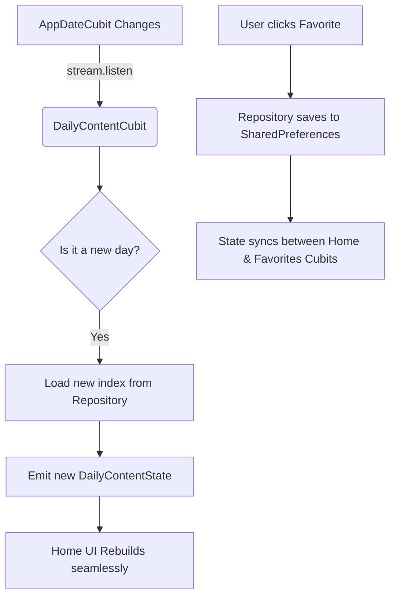

# 📖 Daily Content Feature Documentation

## 🌟 Overview
The `daily_content` feature is responsible for providing users with a fresh, daily dose of Islamic wisdom. Specifically, it manages:
- **Hadith of the Day** (حديث اليوم)
- **Sunnah of the Day** (سنة مهجورة)

It handles loading content from local assets, automatically cycling to new content each day, and managing a persistent list of the user's favorite content.

---

## 🏗️ Architecture Layering
The feature strictly follows **Clean Architecture** and SOLID principles to ensure maintainability and testability.

### 1. Data Layer (`/data`)
- **`DailyContentModel`**: The core data model representing a piece of content. It is annotated with `@immutable` and implements `==` and `hashCode` to prevent unnecessary UI rebuilds.
- **`IDailyContentDataSource`**: An abstract interface for fetching raw JSON data. The implementation (`DailyContentDataSourceImpl`) reads from local assets.
- **`IDailyContentRepository`**: The central brain of the data layer. It handles:
  - **Daily Indexing**: Calculates the difference in days since a fixed epoch (e.g., January 1st) to reliably serve a new item every day.
  - **Persistence**: Loads and saves the user's favorite items to `SharedPreferences`.

### 2. Presentation Layer (`/presentation`)
State management is handled via **Bloc/Cubit**, strictly adhering to the Single Responsibility Principle (SRP):
- **`DailyContentCubit`**: Manages the state of the home screen cards. It actively listens to a global `AppDateCubit`. If the user leaves the app open across midnight, the Cubit detects the date change and automatically reloads the content without requiring an app restart.
- **`DailyFavoritesCubit`**: Manages the Favorites screen state. Extracted to avoid a "God Cubit" anti-pattern, ensuring that the Favorites View only loads its logic when actually visited.

### 3. Dependency Injection (`/di`)
Dependencies are wired up using `get_it` in `daily_content_di.dart`:
- `IDailyContentDataSource` and `IDailyContentRepository` are `LazySingleton`.
- `DailyContentCubit` is a `LazySingleton` because its state needs to persist globally for the Home screen.
- `DailyFavoritesCubit` is a `Factory` because it is instantiated specifically for the Favorites View.

---

## 🔄 Data Flow (Unidirectional Flow)

---

## 🧩 Core Widgets & UI Components

### 1. `DailyContentCard`
A smart, highly generic, and reusable card component.
- Instead of duplicating code for Hadith and Sunnah cards, this single widget takes a `DailyContentType` enum.
- It dynamically resolves the correct icon, title, and state from the `DailyContentCubit`.
- Includes built-in, error-handled actions for **Copying** and **Sharing** content.

### 2. `DailyContentShareCard`
A visually stunning, layout-only widget.
- Used strictly in conjunction with `WidgetToImageHelper` to render a beautiful image off-screen when the user clicks "Share".
- Relies on the `DailyContentType` to render the correct "Department" tag (e.g., *من حديث الحبيب ﷺ*).

### 3. `DailyContentFavoritesView`
A performant list view for favorites.
- Uses a streamlined `CustomScrollView` coupled with `AnimatedSliverList`.
- Free of redundant `NestedScrollView` wrappers to ensure top-tier scrolling performance (60/120 FPS).

---

## 🛠️ Key Technical & Design Decisions

> [!TIP]
> **Performance Optimization**
> All heavy JSON decoding is deferred and cached properly. The UI rebuilds are minimized by strict immutable state equality checks.

> [!IMPORTANT]
> **Safe Async Operations**
> All `Clipboard` and `Share` actions happen asynchronously. The code strictly enforces `if (!context.mounted) return;` before showing `SnackBar`s or navigating, preventing common Flutter memory leaks and crashes.

> [!NOTE]
> **Silent Error Logging**
> If an individual favorite item fails to parse from local storage (e.g., due to a breaking schema change in an update), the repository catches the error, logs it via `AppLogger.localError()`, and safely skips it without crashing the entire Favorites screen or spamming Firebase Crashlytics.

---

## 🚀 How to Extend (e.g., Adding "Duaa of the Day")

To add a new daily content type, follow these steps:
1. **Model**: Add `duaa` to the `DailyContentType` enum in `daily_content_model.dart`.
2. **DataSource**: Add the corresponding JSON file to `assets/json/` and load it inside `DailyContentDataSourceImpl`.
3. **State**: Add a `DailyContentModel? dailyDuaa` field to `DailyContentState`.
4. **UI**: Add `const DailyContentCard(type: DailyContentType.duaa)` inside your UI Carousel. The generic card will handle the rest automatically!
